# Using Cursor for Mobile Development

<div class="pt-12">
  <span @click="$slidev.nav.next" class="px-2 py-1 rounded cursor-pointer" hover="bg-white bg-opacity-10">
    Android + Kotlin + Jetpack Compose with AI <carbon:arrow-right class="inline"/>
  </span>
</div>

<div class="abs-br m-6 flex gap-2">
  <button @click="$slidev.nav.openInEditor()" title="Open in Editor" class="text-xl slidev-icon-btn opacity-50 !border-none !hover:text-white">
    <carbon:edit />
  </button>
</div>

---

# Contact Info

Ken Kousen<br>
Kousen IT, Inc.

- ken.kousen@kousenit.com
- http://www.kousenit.com
- http://kousenit.org (blog)
- Social Media:
  - [@kenkousen](https://twitter.com/kenkousen) (Twitter)
  - [@kousenit.com](https://bsky.app/profile/kousenit.com) (Bluesky)
  - [https://www.linkedin.com/in/kenkousen/](https://www.linkedin.com/in/kenkousen/) (LinkedIn)
- *Tales from the jar side* (free newsletter)
  - https://kenkousen.substack.com
  - https://youtube.com/@talesfromthejarside

---

# Course Overview: 5 Sessions

<v-clicks>

1. **Using Cursor for Java Development** (Session 1 - Complete)
   - Understanding code, navigation, generation, testing
2. **Using Cursor for Mobile Development** (Today - 3 hours)
   - Android/Kotlin with AI assistance
3. **Agentic Coding with Cursor** (3 hours)
   - Advanced AI workflows and automation
4. **Reviewing and Testing Code** (3 hours)
   - Quality assurance with AI
5. **Exploring Agents and MCP** (3 hours)
   - Model Context Protocol and advanced features

</v-clicks>

---

# Today's Session: What We'll Cover

<v-clicks>

- **The Hybrid Workflow** - Cursor + Android Studio working together
- **Cursor Composer Mode** - Multi-file code generation with `@codebase`
- **Building with Compose** - UI components, state management, navigation
- **Data Persistence** - Room database with AI assistance
- **Testing** - ViewModel and Compose UI tests
- **Production Patterns** - Hilt DI, Material 3 theming, accessibility

</v-clicks>

---

# Two Projects Today

<v-clicks>

## Project 1: Task Manager App
Build together from scratch - complete Android app with:
- Jetpack Compose UI
- ViewModels + StateFlow
- Navigation
- Room database

## Project 2: Now in Android
Explore Google's production sample app with AI

</v-clicks>

---
layout: two-cols
---

# Session 1 Recap

## What You Learned

<v-clicks>

- **Chat Mode** (Cmd/Ctrl+L)
  - Ask questions
  - Understand code
  - Learn APIs
  
- **Agent Mode** (Cmd/Ctrl+I)
  - Generate code
  - Refactor
  - Single-file edits

</v-clicks>

::right::

# Today: Composer Mode

## The Power Tool

<v-clicks>

- **Composer** (Cmd/Ctrl+Shift+I)
  - Multi-file generation
  - Full codebase context
  - Complex features
  - Iterative refinement

**Tag `@codebase` for AI to see everything**

</v-clicks>

---

# Part 1: The Hybrid Workflow

## Why You Need BOTH Tools

---
layout: two-cols
---

# Android Studio

<v-clicks>

✅ **Great for:**
- Project creation
- Running apps
- Emulator/device management
- Visual layout preview
- Debugging
- Build management
- SDK management

</v-clicks>

::right::

# Cursor

<v-clicks>

✅ **Great for:**
- AI-powered code generation
- Understanding APIs
- Refactoring
- Test generation
- Boilerplate elimination
- Architecture guidance

</v-clicks>

---

# The Efficient Workflow

```mermaid
graph LR
    A[1. Create Project<br/>Android Studio] --> B[2. Open in Cursor<br/>File → Open Folder]
    B --> C[3. Generate Code<br/>Composer Mode]
    C --> D[4. Review & Accept<br/>in Composer]
    D --> E[5. Run & Test<br/>Android Studio]
    E --> F[6. Iterate<br/>Back to Cursor]
    F --> C
```

<v-clicks>



**Key:** Use each tool for what it's best at!

</v-clicks>

---

# Cursor Composer Mode

## Your New Superpower

<v-clicks>

**Open Composer:**
- Mac: `Cmd + Shift + I`
- Windows/Linux: `Ctrl + Shift + I`

**Best Practices:**
```
@codebase Create a TaskCard composable using Material 3
components with title, description, and completion checkbox.
Use proper spacing and modern Compose patterns.
```

- Always tag `@codebase` for context
- Be specific and detailed
- Describe architecture patterns
- Mention dependencies if needed

</v-clicks>

---

# Demo: Setting Up the Hybrid Workflow

<v-clicks>

1. **Create project in Android Studio**
   - File → New → New Project → Empty Activity
   - Wait for Gradle sync

2. **Open same folder in Cursor**
   - File → Open Folder
   - Navigate to Android project

3. **Test Composer in Cursor**
   - `Cmd/Ctrl+Shift+I`
   - `@codebase Explain this project structure`

4. **Back to Android Studio**
   - Run app (Shift+F10)
   - Verify it works

</v-clicks>

---

# Exercise: Environment Check

**You should have:**

<v-clicks>

✅ Android Studio installed and running
✅ At least one emulator configured (or physical device)
✅ Cursor installed
✅ Same Android project open in both tools
✅ Composer mode tested (`Cmd/Ctrl+Shift+I`)

**Not working?** Ask for help now!

</v-clicks>

---

# Part 2: Building UIs with Jetpack Compose

## From Zero to UI Components

---

# Jetpack Compose Basics

<v-clicks>

## Declarative UI
```kotlin
@Composable
fun Greeting(name: String) {
    Text(text = "Hello, $name!")
}
```

## Key Concepts
- Functions, not XML
- Recomposition on state change
- Material 3 components
- Modifiers for styling

</v-clicks>

---

# Demo: Generating a TaskCard

**In Cursor Composer (Cmd/Ctrl+Shift+I):**

```
@codebase Create a TaskCard composable that displays a task
with title, description, and completed checkbox using
Material 3 components. Use proper spacing and modern
Compose patterns.
```

<v-clicks>

**AI will generate:**
- `@Composable` function
- Material 3 Card, Text, Checkbox
- Proper modifiers (padding, fillMaxWidth)
- State handling

**Accept changes → Switch to Android Studio → Run**

</v-clicks>

---

# Preview Functions

**Back in Cursor Composer:**

```
@codebase Add preview functions showing TaskCard with
different states: uncompleted task, completed task,
and long text overflow
```

<v-clicks>

**Why previews matter:**
- See UI without running app
- Test different states
- Faster iteration

**View in Android Studio's preview pane**

</v-clicks>

---

# Material Design 3

<v-clicks>

## Key Components
- **Card** - Container for related content
- **Text** - Typography with styles
- **Button** - Primary, Secondary, Text
- **Icon** - Material icons
- **TextField** - Input fields

## Styling
- **Modifiers** - padding, size, layout
- **Colors** - From theme
- **Typography** - Headlines, body, labels

</v-clicks>

---

# Demo: Building a TaskList

**In Cursor Composer:**

```
@codebase Create a TaskList composable using LazyColumn
to display a list of tasks. Include proper keys and
content types. Handle empty state. Add sample data for preview.
```

<v-clicks>

**AI generates:**
- LazyColumn for efficient scrolling
- Item keys for performance
- Empty state handling
- Sample data

**Run in Android Studio**

</v-clicks>

---

# LazyColumn Essentials

```kotlin
@Composable
fun TaskList(tasks: List<Task>) {
    LazyColumn {
        items(
            items = tasks,
            key = { task -> task.id }
        ) { task ->
            TaskCard(task = task)
        }
    }
}
```

<v-clicks>

- **LazyColumn** - Like RecyclerView, but simpler
- **items()** - List of items
- **key** - Performance optimization
- Automatically handles scrolling

</v-clicks>

---

# Exercise: Build Your UI

**In Cursor Composer:**

<v-clicks>

1. Generate a customized TaskCard
2. Add preview functions for different states
3. Create a TaskList with sample data
4. Use Chat mode: "How do I make the checkbox larger?"
5. Apply changes in Composer
6. Test in Android Studio

**Time: 15 minutes**

</v-clicks>

---

# Part 3: State Management & Architecture

## MVVM with ViewModels

---

# Understanding MVVM

**First, ask Chat Mode:**

```
Cmd/Ctrl+L: "Explain the MVVM pattern for Android
and how it applies to Jetpack Compose"
```

<v-clicks>

**Model** - Data and business logic
**View** - UI (Composables)
**ViewModel** - State and events

**Unidirectional Data Flow:**
- State flows down
- Events flow up

</v-clicks>

---

# Demo: Creating a ViewModel

**In Cursor Composer:**

```
@codebase Create a TaskViewModel that manages a list of
tasks using StateFlow. Include functions to add, update,
delete, and toggle task completion. Use proper coroutine
scopes and follow Android best practices.
```

<v-clicks>

**AI generates:**
- StateFlow for state
- MutableStateFlow internally
- viewModelScope for coroutines
- Immutable state updates

</v-clicks>

---

# StateFlow Pattern

```kotlin
class TaskViewModel : ViewModel() {
    private val _tasks = MutableStateFlow<List<Task>>(emptyList())
    val tasks: StateFlow<List<Task>> = _tasks.asStateFlow()
    
    fun addTask(task: Task) {
        _tasks.value = _tasks.value + task
    }
    
    fun toggleCompletion(taskId: String) {
        _tasks.value = _tasks.value.map { task ->
            if (task.id == taskId) {
                task.copy(completed = !task.completed)
            } else task
        }
    }
}
```

---

# UI State Pattern

**In Cursor Composer:**

```
@codebase Create a sealed interface TaskListUiState with
states for Loading, Success with task list, and Error with message
```

<v-clicks>

```kotlin
sealed interface TaskListUiState {
    data object Loading : TaskListUiState
    data class Success(val tasks: List<Task>) : TaskListUiState
    data class Error(val message: String) : TaskListUiState
}
```

**Why sealed interfaces?**
- Type-safe state representation
- Exhaustive when expressions
- Clear state transitions

</v-clicks>

---

# Connecting ViewModel to UI

**In Cursor Composer:**

```
@codebase Update TaskList composable to observe
TaskViewModel's StateFlow using collectAsStateWithLifecycle
and handle all UI states (Loading, Success, Error)
```

<v-clicks>

```kotlin
@Composable
fun TaskList(viewModel: TaskViewModel = viewModel()) {
    val uiState by viewModel.uiState.collectAsStateWithLifecycle()
    
    when (uiState) {
        is TaskListUiState.Loading -> LoadingIndicator()
        is TaskListUiState.Success -> TaskList(tasks)
        is TaskListUiState.Error -> ErrorMessage(message)
    }
}
```

</v-clicks>

---

# Exercise: Implement State Management

**Using Composer:**

<v-clicks>

1. Generate a TaskViewModel with StateFlow
2. Create a TaskListUiState sealed interface
3. Connect ViewModel to your TaskList composable
4. Run in Android Studio
5. Add a task and observe UI update
6. Test loading and error states

**Time: 10 minutes**

</v-clicks>

---

# Break Time! ☕

**10 Minutes**

Stretch, grab coffee, be back on time!

---

# Part 4: Navigation

## Building Multi-Screen Apps

---

# Compose Navigation Basics

<v-clicks>

## Key Concepts
- **NavController** - Manages navigation
- **NavHost** - Container for destinations
- **Routes** - String identifiers for screens
- **Arguments** - Pass data between screens

## Type-Safe Navigation
Use sealed classes for routes with parameters

</v-clicks>

---

# Demo: Setting Up Navigation

**In Cursor Composer:**

```
@codebase Add Jetpack Compose Navigation to this project.
Create a sealed class for routes: HomeRoute and
TaskDetailRoute with task ID parameter. Add the required
dependencies to build.gradle if needed.
```

<v-clicks>

**AI will:**
- Add navigation dependencies
- Create Route sealed class
- Set up type-safe navigation

**Build in Android Studio**

</v-clicks>

---

# Navigation Routes

```kotlin
sealed class Route(val route: String) {
    data object Home : Route("home")
    data class TaskDetail(val taskId: String) : Route("task/{taskId}") {
        companion object {
            const val TASK_ID_KEY = "taskId"
        }
    }
}
```

<v-clicks>

**Benefits:**
- Type-safe
- Compile-time checking
- Refactoring-friendly

</v-clicks>

---

# Creating NavHost

**In Cursor Composer:**

```
@codebase Create a NavHost with home screen showing task
list and detail screen for editing a task. Set up the
navigation structure in MainActivity.
```

<v-clicks>

```kotlin
@Composable
fun TaskNavHost(navController: NavHostController) {
    NavHost(navController, startDestination = Route.Home.route) {
        composable(Route.Home.route) {
            TaskListScreen(onTaskClick = { taskId ->
                navController.navigate(Route.TaskDetail(taskId).route)
            })
        }
        composable(
            route = Route.TaskDetail.route,
            arguments = listOf(navArgument("taskId") { type = NavType.StringType })
        ) { backStackEntry ->
            val taskId = backStackEntry.arguments?.getString("taskId")
            TaskDetailScreen(taskId = taskId, onNavigateBack = {
                navController.popBackStack()
            })
        }
    }
}
```

</v-clicks>

---

# Demo: Detail Screen with Form

**In Cursor Composer:**

```
@codebase Create TaskDetailScreen composable that takes a
task ID, loads task from ViewModel, and provides form inputs
to edit title and description with Save and Cancel buttons.
Wire up navigation.
```

<v-clicks>

**AI generates:**
- Form with TextFields
- State management
- Save/Cancel logic
- Navigation handling

**Run and test navigation flow**

</v-clicks>

---

# Exercise: Implement Navigation

**Test your app:**

<v-clicks>

1. Click a task in the list
2. Navigate to detail screen
3. Edit task title and description
4. Click Save
5. Navigate back to list
6. Verify changes persist

**Use Composer to fix any issues!**

**Time: 5 minutes**

</v-clicks>

---

# Part 5: Data Persistence with Room

## Making Data Last

---

# Room Database Overview

<v-clicks>

## Components
- **Entity** - Database table (data class with @Entity)
- **DAO** - Data Access Object (interface with @Dao)
- **Database** - Singleton database instance

## Benefits
- Type-safe SQL
- Compile-time verification
- Flow support for reactive queries
- Coroutines integration

</v-clicks>

---

# Demo: Creating Entity

**In Cursor Composer:**

```
@codebase Create a Task entity for Room database with fields:
id (auto-generated), title (not null), description (nullable),
completed (boolean), createdAt (timestamp). Add Room
dependencies to build.gradle if needed.
```

<v-clicks>

```kotlin
@Entity(tableName = "tasks")
data class Task(
    @PrimaryKey @ColumnInfo(name = "id")
    val id: String = UUID.randomUUID().toString(),
    
    @ColumnInfo(name = "title")
    val title: String,
    
    @ColumnInfo(name = "description")
    val description: String? = null,
    
    @ColumnInfo(name = "completed")
    val completed: Boolean = false,
    
    @ColumnInfo(name = "created_at")
    val createdAt: Long = System.currentTimeMillis()
)
```

</v-clicks>

---

# Demo: Creating DAO

**In Cursor Composer:**

```
@codebase Create TaskDao with functions to: insert, update,
delete task, get all tasks as Flow, get task by ID, and get
completed/incomplete tasks. Use proper suspend functions and Flow.
```

<v-clicks>

```kotlin
@Dao
interface TaskDao {
    @Query("SELECT * FROM tasks ORDER BY created_at DESC")
    fun getAllTasks(): Flow<List<Task>>
    
    @Query("SELECT * FROM tasks WHERE id = :taskId")
    suspend fun getTaskById(taskId: String): Task?
    
    @Insert(onConflict = OnConflictStrategy.REPLACE)
    suspend fun insert(task: Task)
    
    @Update
    suspend fun update(task: Task)
    
    // ... other operations
}
```

**Key patterns:** Flow for reactive queries, suspend for one-shot operations

</v-clicks>

---

# Demo: Creating Database

**In Cursor Composer:**

```
@codebase Create AppDatabase extending RoomDatabase with
TaskDao. Include version, entities, and proper database
configuration.
```

<v-clicks>

```kotlin
@Database(entities = [Task::class], version = 1)
abstract class AppDatabase : RoomDatabase() {
    abstract fun taskDao(): TaskDao
    
    companion object {
        @Volatile
        private var INSTANCE: AppDatabase? = null
        
        fun getInstance(context: Context): AppDatabase {
            return INSTANCE ?: synchronized(this) {
                Room.databaseBuilder(/* ... */)
                    .fallbackToDestructiveMigration()
                    .build()
            }
        }
    }
}
```

**Pattern:** Singleton with double-checked locking

</v-clicks>

---

# Repository Pattern

**In Cursor Composer:**

```
@codebase Create TaskRepository that uses TaskDao and
exposes Flow for task list and suspend functions for CRUD
operations. Update TaskViewModel to use this real repository
instead of fake data.
```

<v-clicks>

**Why Repository?**
- Abstraction over data source
- Easier testing
- Single source of truth
- Can combine local + remote data

</v-clicks>

---

# Demo: Testing Persistence

**In Android Studio:**

<v-clicks>

1. Run the app
2. Add several tasks
3. Toggle some as completed
4. Force stop the app (don't just background)
5. Reopen the app
6. **Tasks should still be there!** ✅

**If not, check:**
- Room dependencies added?
- Database initialized?
- ViewModel using real repository?

</v-clicks>

---

# Exercise: Verify Persistence

**Test in Android Studio:**

<v-clicks>

1. Add 3-5 tasks with different content
2. Complete some tasks
3. Close app completely
4. Reopen app
5. Verify all tasks persist
6. Edit a task and verify changes save

**Use Chat mode if issues arise!**

**Time: 5 minutes**

</v-clicks>

---

# Break Time! ☕

**10 Minutes**

We're past the halfway point!

---

# Part 6: Testing Android Components

## TDD with AI Assistance

---

# Testing Philosophy

<v-clicks>

## Types of Tests
- **Unit Tests** - ViewModels, repositories (fast, isolated)
- **UI Tests** - Composables with ComposeTestRule
- **Integration Tests** - Multiple components together

## With AI
- Generate comprehensive test suites quickly
- Cover edge cases you might miss
- Learn testing patterns

**But always review generated tests!**

</v-clicks>

---

# Demo: ViewModel Testing

**In Cursor Composer:**

```
@codebase Generate unit tests for TaskViewModel using
JUnit 5 and MockK. Test adding a task, deleting a task,
and toggling completion. Use Turbine for testing Flow
emissions. Add test dependencies to build.gradle if needed.
```

<v-clicks>

**AI generates:**
- Test class structure
- Mock repository
- Coroutine test setup
- Flow testing with Turbine
- Multiple test cases

**Run: `./gradlew test`**

</v-clicks>

---

# ViewModel Test Example

```kotlin
@OptIn(ExperimentalCoroutinesApi::class)
class TaskViewModelTest {
    @get:Rule
    val mainDispatcherRule = MainDispatcherRule()
    
    private lateinit var repository: TaskRepository
    private lateinit var viewModel: TaskViewModel
    
    @Test
    fun `addTask updates state with new task`() = runTest {
        // Given
        coEvery { repository.insertTask(any()) } just Runs
        
        // When
        viewModel.addTask("Test Task", "Description")
        
        // Then
        viewModel.tasks.test {
            assertThat(awaitItem()).contains(newTask)
        }
    }
}
```

---

# Demo: Compose UI Testing

**In Cursor Composer:**

```
@codebase Generate Compose UI tests for TaskCard using
ComposeTestRule. Test that title and description are
displayed, checkbox reflects completed state, and clicking
checkbox triggers callback.
```

<v-clicks>

**AI generates:**
- ComposeTestRule setup
- Finding nodes by semantic properties
- Assertions (text, state)
- User interactions (clicks)

</v-clicks>

---

# Compose UI Test Example

```kotlin
class TaskCardTest {
    @get:Rule
    val composeTestRule = createComposeRule()
    
    @Test
    fun taskCard_displaysTaskInformation() {
        val task = Task(title = "Test Task", description = "Test Description")
        
        composeTestRule.setContent {
            TaskCard(task = task, onToggleComplete = {})
        }
        
        composeTestRule.onNodeWithText("Test Task").assertIsDisplayed()
        composeTestRule.onNodeWithText("Test Description").assertIsDisplayed()
    }
}
```

**Key concepts:** setContent, onNodeWithText, assertions

---

# Semantic Properties

```kotlin
@Composable
fun TaskCard(task: Task, onToggleComplete: () -> Unit) {
    Card {
        Row(modifier = Modifier.semantics { testTag = "task-card" }) {
            Text(
                text = task.title,
                modifier = Modifier.semantics { testTag = "task-title" }
            )
            Checkbox(
                checked = task.completed,
                onCheckedChange = { onToggleComplete() },
                modifier = Modifier.semantics { 
                    contentDescription = "Task completion"
                }
            )
        }
    }
}
```

<v-clicks>

**Semantic properties help with:**
- Testing
- Accessibility
- UI automation

</v-clicks>

---

# Exercise: Run Tests

**In Android Studio or Terminal:**

<v-clicks>

```bash
./gradlew test              # Unit tests
./gradlew connectedCheck    # UI tests (requires device)
```

1. Run generated tests
2. Review test results
3. Use Composer to add one custom test
4. If test fails, use Chat: "Why is my test failing?"

**Time: 5 minutes**

</v-clicks>

---

# Part 7: Advanced Topics

## Production-Ready Polish

---

# Hilt Dependency Injection

**In Cursor Composer:**

```
@codebase Add Hilt dependency injection to this project.
Create Application class annotated with @HiltAndroidApp,
create a module to provide TaskRepository and Room database,
and set up ViewModel injection. Add all necessary
dependencies to build.gradle.
```

<v-clicks>

**AI generates:**
- Application class
- Hilt modules
- ViewModel integration
- All annotations

**Why Hilt?**
- Compile-time DI
- Less boilerplate
- Android-specific

</v-clicks>

---

# Hilt Application & Module

```kotlin
@HiltAndroidApp
class TaskApplication : Application()

@Module
@InstallIn(SingletonComponent::class)
object DatabaseModule {
    @Provides
    @Singleton
    fun provideDatabase(@ApplicationContext context: Context): AppDatabase {
        return AppDatabase.getInstance(context)
    }
    
    @Provides
    @Singleton
    fun provideTaskRepository(taskDao: TaskDao): TaskRepository {
        return TaskRepository(taskDao)
    }
}
```

---

# Hilt ViewModel Injection

```kotlin
@HiltViewModel
class TaskViewModel @Inject constructor(
    private val repository: TaskRepository
) : ViewModel() {
    // ... ViewModel implementation
}

@Composable
fun TaskListScreen(
    viewModel: TaskViewModel = hiltViewModel() // Injected!
) {
    // ...
}
```

**Key:** `@HiltViewModel` + `@Inject` constructor + `hiltViewModel()`

---

# Material 3 Theming

**In Cursor Composer:**

```
@codebase Create a Material 3 theme with custom color
scheme (purple primary) and add dark theme support using
dynamic colors. Apply this theme to the app.
```

<v-clicks>

**AI generates:**
- Color scheme (light + dark)
- Typography
- Shapes
- Theme composable

**Test dark mode in Android Studio!**

</v-clicks>

---

# Material 3 Color Schemes

```kotlin
private val LightColorScheme = lightColorScheme(
    primary = Purple80,
    secondary = PurpleGrey80,
    tertiary = Pink80
)

private val DarkColorScheme = darkColorScheme(
    primary = Purple40,
    secondary = PurpleGrey40,
    tertiary = Pink40
)
```

---

# Material 3 Theme Composable

```kotlin
@Composable
fun TaskManagerTheme(
    darkTheme: Boolean = isSystemInDarkTheme(),
    dynamicColor: Boolean = true,
    content: @Composable () -> Unit
) {
    val colorScheme = when {
        dynamicColor && Build.VERSION.SDK_INT >= Build.VERSION_CODES.S ->
            if (darkTheme) dynamicDarkColorScheme(LocalContext.current)
            else dynamicLightColorScheme(LocalContext.current)
        darkTheme -> DarkColorScheme
        else -> LightColorScheme
    }
    
    MaterialTheme(colorScheme = colorScheme, content = content)
}
```

---

# Accessibility

**Use Chat Mode for Review:**

```
Chat: "Review TaskCard for accessibility. What improvements
would help screen reader users?"
```

<v-clicks>

**Then use Composer to apply:**

```
@codebase Add semantic properties to TaskCard for better
accessibility
```

**Key Properties:**
- `contentDescription` - Describe images/icons
- `Role.Checkbox` - Semantic roles
- `testTag` - For testing
- Minimum touch targets (48dp)

</v-clicks>

---

# Performance Optimization

**Use Chat Mode:**

```
Chat: "Review TaskList for potential recomposition issues
and suggest optimizations"
```

<v-clicks>

**Common Optimizations:**
- `remember` - Cache computations
- `derivedStateOf` - Calculated state
- `key` in LazyColumn - Proper item identification
- Immutable data classes
- Stable parameters

**Apply in Composer if needed**

</v-clicks>

---

# Exercise: Polish Your App

**Using Composer and Chat:**

<v-clicks>

1. Add Hilt DI to your project
2. Apply Material 3 theme
3. Toggle dark mode in Android Studio
4. Use Chat to review accessibility
5. Apply accessibility improvements
6. Ask for performance review

**Time: 5 minutes**

</v-clicks>

---

# Part 8: Now in Android

## Learning from Google's Sample

---

# Now in Android Overview

<v-clicks>

## What is it?
- Official Google sample app
- Production-quality code
- Modern Android practices
- Fully open source

## What you'll learn:
- Multi-module architecture
- Build conventions
- Advanced Compose patterns
- Comprehensive testing

</v-clicks>

---

# Demo: Exploring with AI

**Clone and open:**

```bash
git clone https://github.com/android/nowinandroid
# Open in Android Studio (to run)
# Open in Cursor (to analyze)
```

<v-clicks>

**In Cursor Chat Mode:**

```
Chat: "Explain the overall architecture of Now in Android app"
Chat: "What is the purpose of the :core:data module?"
Chat: "How is the navigation implemented?"
Chat: "What testing strategies are used?"
```

**Run in Android Studio to see the real app**

</v-clicks>

---

# Multi-Module Architecture

```
nowinandroid/
├── app/                    # Main app module
├── core/
│   ├── data/              # Data layer
│   ├── database/          # Room database
│   ├── datastore/         # Preferences
│   ├── model/             # Data models
│   ├── network/           # API calls
│   └── ui/                # Common UI
├── feature/
│   ├── foryou/            # For You screen
│   ├── interests/         # Interests screen
│   └── bookmarks/         # Bookmarks screen
└── build-logic/           # Build configuration
```

<v-clicks>

**Benefits:**
- Clear separation of concerns
- Parallel builds
- Reusable modules
- Team scalability

</v-clicks>

---

# Exercise: Explore Now in Android

**In Cursor Chat Mode, ask:**

<v-clicks>

1. "How many feature modules are there?"
2. "Explain the DI setup in this app"
3. "What design system components are used?"
4. "How is offline support implemented?"
5. "What testing patterns are used?"

**Compare with your Task Manager app**

**Time: 5 minutes**

</v-clicks>

---

# Wrap-Up: Key Takeaways

---

# What We Built Today

<v-clicks>

✅ **Complete Android App**
- Jetpack Compose UI with Material 3
- ViewModels with StateFlow
- Multi-screen navigation
- Room database persistence
- Hilt dependency injection
- Comprehensive test suite
- Dark theme support
- Accessibility features

**All with AI assistance!**

</v-clicks>

---

# The Hybrid Workflow Decision Tree

```
Need to understand code/APIs?
  → Use Chat mode (Cmd/Ctrl+L)

Need to generate/modify code?
  → Use Composer (Cmd/Ctrl+Shift+I) with @codebase

Need to run/test app?
  → Switch to Android Studio

Need to debug layout?
  → Use Chat to explain, then Composer to fix

Need to add feature?
  → Use Composer with detailed instructions + @codebase

Need multi-file changes?
  → Always use Composer, never manual editing
```

---

# Best Practices We Learned

<v-clicks>

1. **Always tag `@codebase`** - Give AI full context
2. **Be specific in prompts** - More detail = better results
3. **Use each tool for its strength** - Cursor for code, Android Studio for running
4. **Iterate with AI** - Start simple, refine with follow-ups
5. **Review AI output** - Don't blindly accept
6. **Test frequently** - Run app after each feature
7. **Ask Chat before generating** - Understand concepts first

</v-clicks>

---

# Comparing Session 1 vs Session 2

| Session 1 (Java/Spring) | Session 2 (Android/Compose) |
|-------------------------|----------------------------|
| REST Controllers | Composable functions |
| Service Layer | ViewModels |
| JPA Repositories | Room DAOs |
| Spring DI | Hilt DI |
| Spring Boot Tests | Compose Tests |
| Backend API | Mobile UI |

<v-clicks>

**Same principles:**
- AI for code generation
- Iterative development
- Testing with AI
- Architecture patterns

**Different platforms, same power!**

</v-clicks>

---

# Common Pitfalls to Avoid

<v-clicks>

❌ **Don't:**
- Use Cursor exclusively (need Android Studio too)
- Forget `@codebase` tag
- Accept AI code without review
- Skip testing
- Ignore accessibility
- Over-rely on AI for debugging

✅ **Do:**
- Use hybrid workflow
- Write detailed prompts
- Review and understand generated code
- Test on real devices
- Ask Chat mode for explanations
- Use AI as a learning tool

</v-clicks>

---

# Preview: Session 3

## Agentic Coding with Cursor

<v-clicks>

**Coming up:**
- Extended Thinking mode
- Plan Mode for complex changes
- Custom slash commands
- Team collaboration workflows
- Code review with AI
- Advanced automation

**Get ready to level up even more!**

</v-clicks>

---

# Homework / Lab Exercises

<v-clicks>

**Part A: Reinforce Today's Learning**
- Complete Task Manager features (if not done)
- Add categories or tags to tasks
- Implement due dates
- Add search/filter functionality

**Part B: Explore Now in Android**
- Deep dive into architecture
- Analyze testing strategies
- Compare patterns with your app
- Extract learnings

**See `android_labs.md` for details**

</v-clicks>

---

# Resources

**Official Documentation:**
- [Jetpack Compose](https://developer.android.com/jetpack/compose)
- [Android Architecture Guide](https://developer.android.com/topic/architecture)
- [Room Database](https://developer.android.com/training/data-storage/room)
- [Hilt DI](https://developer.android.com/training/dependency-injection/hilt-android)
- [Now in Android](https://github.com/android/nowinandroid)

**Learning:**
- [Compose Pathway](https://developer.android.com/courses/pathways/compose)
- [Testing in Compose](https://developer.android.com/jetpack/compose/testing)
- [Kotlin Coroutines](https://kotlinlang.org/docs/coroutines-guide.html)

---

# Questions?

<div class="text-center mt-10">
  <h2>Open Q&A</h2>
  <p class="text-xl mt-4">
    Ask about anything we covered today:
  </p>
  <ul class="text-left mx-auto max-w-2xl mt-6">
    <li>Hybrid workflow</li>
    <li>Composer mode</li>
    <li>Jetpack Compose</li>
    <li>State management</li>
    <li>Room database</li>
    <li>Testing</li>
    <li>Your own projects</li>
  </ul>
</div>

---
layout: end
---

# Thank You!

**Contact:**
- ken.kousen@kousenit.com
- http://kousenit.com
- [@kenkousen](https://twitter.com/kenkousen)

**Continue Learning:**
- Complete homework labs
- Explore Now in Android
- Apply to your projects
- Join us for Session 3!

<div class="text-center mt-8">
  <p class="text-2xl">Happy Coding with AI! 🚀</p>
</div>

