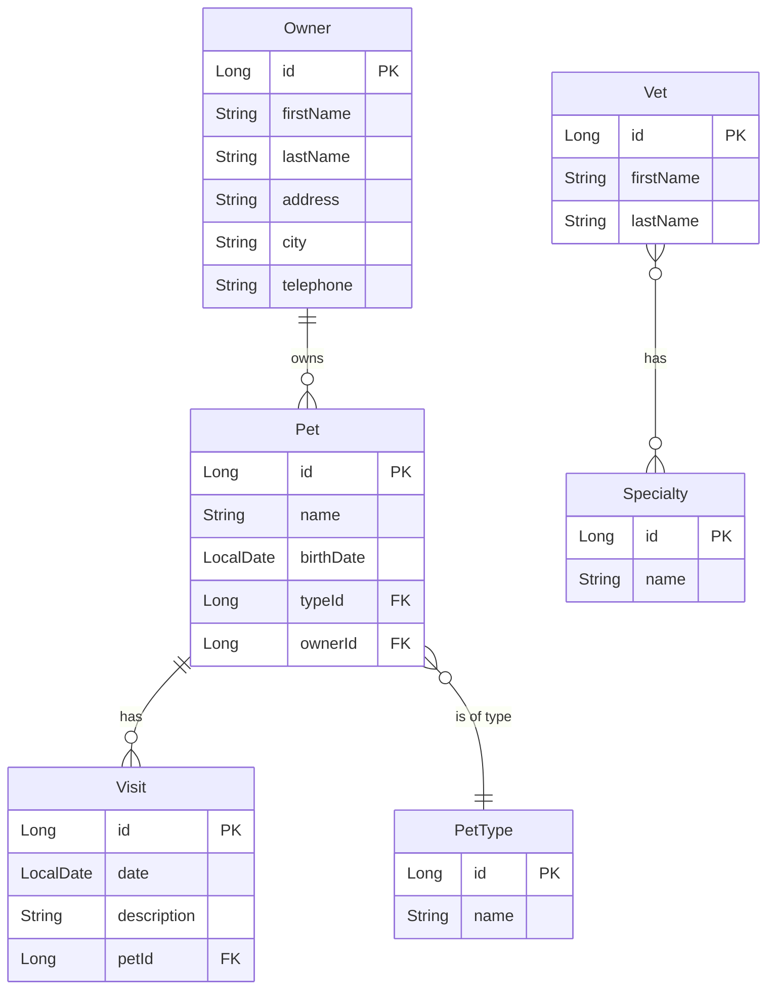

# Spring PetClinic - Exploration Guide

This guide supports Lab 6, 7, and 8 from Session 1. It provides context and additional resources for exploring the Spring PetClinic application.

## Overview

**Spring PetClinic** is a sample Spring Boot application that demonstrates:
- Multi-layered architecture
- Spring MVC with Thymeleaf templates
- Spring Data JPA with multiple databases
- Bean validation
- Comprehensive testing strategies
- Professional project structure

**GitHub:** [https://github.com/spring-projects/spring-petclinic](https://github.com/spring-projects/spring-petclinic)

---

## Getting Started

### Clone and Setup

```bash
# Clone the repository
cd ~/projects  # or your preferred location
git clone https://github.com/spring-projects/spring-petclinic
cd spring-petclinic

# Open in new Cursor window
cursor .

# Build and run (Maven)
./mvnw spring-boot:run

# Or with Gradle (if using Gradle variant)
./gradlew bootRun
```

### First Exploration

1. **Browse the application:** http://localhost:8080
2. **Explore the UI:**
   - Find owners
   - View owner details
   - Add a pet
   - Register a visit
   - View veterinarians

3. **Access H2 Console:** http://localhost:8080/h2-console
   - JDBC URL: `jdbc:h2:mem:testdb`
   - Username: `sa`
   - Password: (empty)

---

## Architecture Overview

### Package Structure

```
org.springframework.samples.petclinic/
├── model/              # Domain entities
│   ├── BaseEntity.java
│   ├── NamedEntity.java
│   ├── Person.java
│   ├── Owner.java
│   ├── Pet.java
│   ├── PetType.java
│   ├── Specialty.java
│   ├── Vet.java
│   └── Visit.java
├── owner/              # Owner feature
│   ├── Owner.java
│   ├── OwnerController.java
│   ├── OwnerRepository.java
│   └── PetController.java
├── vet/                # Veterinarian feature
│   ├── Vet.java
│   ├── VetController.java
│   └── VetRepository.java
├── visit/              # Visit feature
│   ├── Visit.java
│   ├── VisitController.java
│   └── VisitRepository.java
└── system/             # System/shared
    └── WelcomeController.java
```

### Design Patterns

1. **Repository Pattern**
   - Spring Data JPA repositories
   - Custom query methods
   - Derived queries vs `@Query` annotations

2. **MVC Pattern**
   - Controllers handle HTTP
   - Services contain business logic (minimal in this app)
   - Repositories handle data access

3. **Domain Model**
   - Rich domain entities
   - JPA relationships
   - Inheritance hierarchies

4. **Template Method**
   - BaseEntity → NamedEntity → Person
   - Shared behavior in base classes

---

## Entity Relationship Diagram



---

## Key Learning Areas

### 1. Entity Relationships

#### One-to-Many: Owner → Pets

**Owner.java:**
```java
@OneToMany(cascade = CascadeType.ALL, fetch = FetchType.EAGER, mappedBy = "owner")
private Set<Pet> pets = new LinkedHashSet<>();
```

**Why EAGER?**
- UI always needs pets when showing owner
- Avoids lazy loading exceptions
- Trade-off: slightly larger queries

**Ask Chat:**
```
Explain the cascade and fetch settings on Owner.pets relationship.
When would LAZY loading be better?
```

#### One-to-Many: Pet → Visits

**Pet.java:**
```java
@OneToMany(cascade = CascadeType.ALL, fetch = FetchType.EAGER, mappedBy = "pet")
private Set<Visit> visits = new LinkedHashSet<>();
```

**Sorted visits:**
```java
public List<Visit> getVisits() {
    return this.visits.stream()
        .sorted(Comparator.comparing(Visit::getDate).reversed())
        .toList();
}
```

**Ask Chat:**
```
Why does PetClinic sort visits in the getter instead of using @OrderBy?
What are the pros and cons of each approach?
```

#### Many-to-Many: Vet ↔ Specialties

**Vet.java:**
```java
@ManyToMany(fetch = FetchType.EAGER)
@JoinTable(
    name = "vet_specialties",
    joinColumns = @JoinColumn(name = "vet_id"),
    inverseJoinColumns = @JoinColumn(name = "specialty_id")
)
private Set<Specialty> specialties = new LinkedHashSet<>();
```

**Ask Chat:**
```
Explain how the many-to-many relationship between Vet and Specialty works.
Show me the SQL DDL for the join table.
```

### 2. Repository Patterns

#### Derived Query Methods

**OwnerRepository.java:**
```java
public interface OwnerRepository extends Repository<Owner, Integer> {
    
    /**
     * Retrieve all Owners from the database.
     */
    @Query("SELECT DISTINCT owner FROM Owner owner LEFT JOIN FETCH owner.pets")
    Collection<Owner> findAll();
    
    /**
     * Retrieve Owners from the database by last name.
     */
    @Query("SELECT DISTINCT owner FROM Owner owner LEFT JOIN FETCH owner.pets WHERE owner.lastName LIKE :lastName%")
    Collection<Owner> findByLastName(@Param("lastName") String lastName);
    
    /**
     * Retrieve an Owner from the database by id.
     */
    @Query("SELECT owner FROM Owner owner LEFT JOIN FETCH owner.pets WHERE owner.id = :id")
    Owner findById(@Param("id") Integer id);
    
    /**
     * Save an Owner to the database.
     */
    void save(Owner owner);
}
```

**Key Observations:**
- Custom `@Query` with JOIN FETCH (avoid N+1)
- DISTINCT to prevent duplicate owners
- Explicit repository interface (not JpaRepository)

**Ask Chat:**
```
Why does PetClinic use explicit @Query annotations instead of 
derived query methods like findByLastNameStartingWith?
```

#### Simple Repository

**PetTypeRepository.java:**
```java
public interface PetTypeRepository extends Repository<PetType, Integer> {
    List<PetType> findAll();
    PetType findById(Integer id);
}
```

**Ask Chat:**
```
Compare this PetTypeRepository to OwnerRepository.
Why doesn't it need complex queries?
```

### 3. Controller Patterns

#### Owner Management

**OwnerController.java - Create Flow:**
```java
@GetMapping("/owners/new")
public String initCreationForm(Map<String, Object> model) {
    Owner owner = new Owner();
    model.put("owner", owner);
    return "owners/createOrUpdateOwnerForm";
}

@PostMapping("/owners/new")
public String processCreationForm(@Valid Owner owner, BindingResult result) {
    if (result.hasErrors()) {
        return "owners/createOrUpdateOwnerForm";
    }
    this.owners.save(owner);
    return "redirect:/owners/" + owner.getId();
}
```

**Pattern: GET/POST pairing**
- GET: Show form with empty model
- POST: Process form with validation
- Redirect on success (PRG pattern)

**Ask Chat:**
```
Explain the Post-Redirect-Get pattern used in processCreationForm.
Why is this better than returning a template directly?
```

#### Pet Management

**PetController.java - Update Flow:**
```java
@GetMapping("/owners/{ownerId}/pets/{petId}/edit")
public String initUpdateForm(@PathVariable("petId") int petId, Model model) {
    Pet pet = this.pets.findById(petId);
    model.addAttribute("pet", pet);
    return "pets/createOrUpdatePetForm";
}

@PostMapping("/owners/{ownerId}/pets/{petId}/edit")
public String processUpdateForm(@Valid Pet pet, BindingResult result, Owner owner) {
    if (result.hasErrors()) {
        return "pets/createOrUpdatePetForm";
    }
    owner.addPet(pet);
    this.pets.save(pet);
    return "redirect:/owners/{ownerId}";
}
```

**Path Variables:**
- `{ownerId}` - Context for pet
- `{petId}` - Specific pet to edit
- Both in path for clear REST semantics

**Ask Chat:**
```
Why does the pet URL include ownerId even though it's not used in the method?
Is this good REST API design?
```

### 4. Template Integration

#### Owner Details Template

**ownerDetails.html (simplified):**
```html
<html xmlns:th="https://www.thymeleaf.org">
<body>
  <h2>Owner Information</h2>
  
  <table class="table">
    <tr>
      <th>Name</th>
      <td><b th:text="${owner.firstName + ' ' + owner.lastName}"></b></td>
    </tr>
    <tr>
      <th>Address</th>
      <td th:text="${owner.address}"></td>
    </tr>
    <tr>
      <th>City</th>
      <td th:text="${owner.city}"></td>
    </tr>
    <tr>
      <th>Telephone</th>
      <td th:text="${owner.telephone}"></td>
    </tr>
  </table>
  
  <a th:href="@{/owners/{id}/edit(id=${owner.id})}" class="btn btn-default">Edit Owner</a>
  <a th:href="@{/owners/{id}/pets/new(id=${owner.id})}" class="btn btn-default">Add New Pet</a>
  
  <h2>Pets and Visits</h2>
  
  <table class="table">
    <tr th:each="pet : ${owner.pets}">
      <td valign="top">
        <dl class="dl-horizontal">
          <dt>Name</dt>
          <dd th:text="${pet.name}"></dd>
          <dt>Birth Date</dt>
          <dd th:text="${#temporals.format(pet.birthDate, 'yyyy-MM-dd')}"></dd>
          <dt>Type</dt>
          <dd th:text="${pet.type.name}"></dd>
        </dl>
      </td>
      <td valign="top">
        <table class="table-condensed">
          <thead>
            <tr>
              <th>Visit Date</th>
              <th>Description</th>
            </tr>
          </thead>
          <tbody>
            <tr th:each="visit : ${pet.visits}">
              <td th:text="${#temporals.format(visit.date, 'yyyy-MM-dd')}"></td>
              <td th:text="${visit.description}"></td>
            </tr>
          </tbody>
        </table>
        <a th:href="@{/owners/{ownerId}/pets/{petId}/visits/new(ownerId=${owner.id},petId=${pet.id})}" 
           class="btn btn-primary">Add Visit</a>
      </td>
    </tr>
  </table>
</body>
</html>
```

**Thymeleaf Features Used:**
- `th:text` - Text content
- `th:href` - Dynamic URLs with `@{...}`
- `th:each` - Iteration
- `${...}` - Variable expressions
- `#temporals` - Date formatting utility

**Ask Chat:**
```
Explain the Thymeleaf expression: 
@{/owners/{id}/pets/new(id=${owner.id})}

How does it construct the final URL?
```

#### Form Template

**createOrUpdateOwnerForm.html:**
```html
<form th:object="${owner}" class="form-horizontal" method="post">
  <div class="form-group has-feedback">
    <input
      th:field="*{firstName}"
      class="form-control"
      placeholder="First Name"
      th:class="${#fields.hasErrors('firstName')} ? 'form-control is-invalid' : 'form-control'"
    />
    <span th:if="${#fields.hasErrors('firstName')}" 
          th:errors="*{firstName}" 
          class="invalid-feedback"></span>
  </div>
  
  <div class="form-group has-feedback">
    <input
      th:field="*{lastName}"
      class="form-control"
      placeholder="Last Name"
      th:class="${#fields.hasErrors('lastName')} ? 'form-control is-invalid' : 'form-control'"
    />
    <span th:if="${#fields.hasErrors('lastName')}" 
          th:errors="*{lastName}" 
          class="invalid-feedback"></span>
  </div>
  
  <button class="btn btn-primary" type="submit">
    <span th:text="${owner['new']} ? 'Add Owner' : 'Update Owner'"></span>
  </button>
</form>
```

**Form Binding:**
- `th:object` - Binds form to model object
- `th:field` - Generates name, id, value attributes
- `*{fieldName}` - Selection expression (relative to `th:object`)
- `#fields.hasErrors()` - Checks for validation errors
- `th:errors` - Displays error messages

**Ask Chat:**
```
Explain how Thymeleaf's th:field and th:errors work together 
to provide form validation feedback.
```

### 5. Validation

#### Entity Validation

**Owner.java:**
```java
@NotBlank
private String firstName;

@NotBlank
private String lastName;

@NotBlank
private String address;

@NotBlank
private String city;

@NotBlank
@Digits(fraction = 0, integer = 10)
private String telephone;
```

**Pet.java:**
```java
@NotBlank
private String name;

@NotNull
private LocalDate birthDate;

@NotNull
private PetType type;
```

**Validation Annotations:**
- `@NotBlank` - Not null, not empty, not just whitespace
- `@NotNull` - Must be present
- `@Digits` - Numeric validation

**Ask Chat:**
```
What's the difference between @NotNull, @NotEmpty, and @NotBlank?
When should I use each one?
```

#### Custom Validation

**PetValidator.java:**
```java
public class PetValidator implements Validator {
    
    @Override
    public void validate(Object obj, Errors errors) {
        Pet pet = (Pet) obj;
        String name = pet.getName();
        
        // name validation
        if (!StringUtils.hasLength(name)) {
            errors.rejectValue("name", "required", "required");
        }
        
        // type validation
        if (pet.isNew() && pet.getType() == null) {
            errors.rejectValue("type", "required", "required");
        }
        
        // birth date validation
        if (pet.getBirthDate() == null) {
            errors.rejectValue("birthDate", "required", "required");
        }
    }
    
    @Override
    public boolean supports(Class<?> clazz) {
        return Pet.class.isAssignableFrom(clazz);
    }
}
```

**Used in Controller:**
```java
@InitBinder("pet")
public void initPetBinder(WebDataBinder dataBinder) {
    dataBinder.setValidator(new PetValidator());
}
```

**Ask Chat:**
```
When should I use custom validators instead of standard 
validation annotations?
```

### 6. Database Configuration

#### H2 (Default Development)

**application.properties:**
```properties
# H2 Database
spring.datasource.url=jdbc:h2:mem:testdb
spring.datasource.username=sa
spring.datasource.password=

# JPA/Hibernate
spring.jpa.show-sql=true
spring.jpa.hibernate.ddl-auto=create-drop

# H2 Console
spring.h2.console.enabled=true
```

#### MySQL Profile

**application-mysql.properties:**
```properties
# MySQL Database
spring.datasource.url=jdbc:mysql://localhost:3306/petclinic
spring.datasource.username=petclinic
spring.datasource.password=petclinic

# JPA/Hibernate with MySQL
spring.jpa.database=MYSQL
spring.jpa.database-platform=org.hibernate.dialect.MySQLDialect
spring.jpa.hibernate.ddl-auto=none

# Initialize schema
spring.sql.init.mode=always
spring.sql.init.schema-locations=classpath:db/mysql/schema.sql
spring.sql.init.data-locations=classpath:db/mysql/data.sql
```

**Activate Profile:**
```bash
# Using Maven
./mvnw spring-boot:run -Dspring-boot.run.profiles=mysql

# Using Gradle
./gradlew bootRun --args='--spring.profiles.active=mysql'

# Using JAR
java -jar -Dspring.profiles.active=mysql target/spring-petclinic-*.jar
```

**Ask Chat:**
```
Explain how Spring profiles allow switching between H2 and MySQL.
What files are involved and what changes?
```

### 7. Testing Strategies

#### Repository Tests

**OwnerRepositoryTests.java:**
```java
@DataJpaTest
class OwnerRepositoryTests {
    
    @Autowired
    private OwnerRepository owners;
    
    @Test
    void shouldFindOwnersByLastName() {
        Collection<Owner> owners = this.owners.findByLastName("Davis");
        assertThat(owners).hasSize(2);
    }
    
    @Test
    void shouldFindOwnerById() {
        Owner owner = this.owners.findById(1);
        assertThat(owner.getFirstName()).isEqualTo("George");
        assertThat(owner.getPets()).hasSize(1);
    }
    
    @Test
    @Transactional
    void shouldInsertOwner() {
        Collection<Owner> owners = this.owners.findAll();
        int found = owners.size();
        
        Owner owner = new Owner();
        owner.setFirstName("John");
        owner.setLastName("Doe");
        owner.setAddress("123 Main St");
        owner.setCity("Springfield");
        owner.setTelephone("5551234567");
        
        this.owners.save(owner);
        assertThat(owner.getId()).isNotNull();
        
        owners = this.owners.findAll();
        assertThat(owners).hasSize(found + 1);
    }
}
```

**@DataJpaTest Benefits:**
- Configures H2 in-memory database
- Scans for `@Entity` classes
- Configures Spring Data JPA repositories
- Provides `TestEntityManager`
- Transactions rollback after each test

**Ask Chat:**
```
Explain what @DataJpaTest does and how it differs from @SpringBootTest
```

#### Controller Tests

**OwnerControllerTests.java:**
```java
@WebMvcTest(OwnerController.class)
class OwnerControllerTests {
    
    @Autowired
    private MockMvc mockMvc;
    
    @MockBean
    private OwnerRepository owners;
    
    @BeforeEach
    void setup() {
        Owner george = new Owner();
        george.setId(1);
        george.setFirstName("George");
        george.setLastName("Franklin");
        given(this.owners.findById(1)).willReturn(george);
    }
    
    @Test
    void testShowOwner() throws Exception {
        mockMvc.perform(get("/owners/{ownerId}", 1))
            .andExpect(status().isOk())
            .andExpect(model().attributeExists("owner"))
            .andExpect(view().name("owners/ownerDetails"));
    }
    
    @Test
    void testProcessCreationFormSuccess() throws Exception {
        mockMvc.perform(post("/owners/new")
                .param("firstName", "Joe")
                .param("lastName", "Bloggs")
                .param("address", "123 Caramel Street")
                .param("city", "London")
                .param("telephone", "01316761638"))
            .andExpect(status().is3xxRedirection());
    }
    
    @Test
    void testProcessCreationFormHasErrors() throws Exception {
        mockMvc.perform(post("/owners/new")
                .param("firstName", "Joe")
                .param("lastName", "Bloggs")
                .param("city", "London"))
            .andExpect(status().isOk())
            .andExpect(model().attributeHasErrors("owner"))
            .andExpect(model().attributeHasFieldErrors("owner", "address"))
            .andExpect(model().attributeHasFieldErrors("owner", "telephone"))
            .andExpect(view().name("owners/createOrUpdateOwnerForm"));
    }
}
```

**@WebMvcTest Benefits:**
- Tests only the web layer
- Auto-configures MockMvc
- Loads only specified controller
- Requires `@MockBean` for dependencies
- Fast execution (no full context)

**Ask Chat:**
```
Explain the difference between @WebMvcTest and @SpringBootTest 
for testing controllers. When should I use each?
```

---

## Advanced Exploration

### Challenge: Performance Analysis

**Task: Find N+1 Query Problems**

1. **Enable SQL Logging:**
   ```properties
   spring.jpa.show-sql=true
   spring.jpa.properties.hibernate.format_sql=true
   logging.level.org.hibernate.SQL=DEBUG
   logging.level.org.hibernate.type.descriptor.sql.BasicBinder=TRACE
   ```

2. **Test Scenario:**
   - Navigate to: http://localhost:8080/owners?lastName=
   - Watch console for SQL queries

3. **Ask Chat:**
   ```
   I see multiple SELECT queries for pets when loading the owners list.
   Is this an N+1 problem? How can I fix it?
   ```

4. **Expected Finding:**
   - Owner query uses `LEFT JOIN FETCH pets`
   - No N+1 problem! Already optimized

### Challenge: Add REST API

**Task: Create REST endpoints alongside MVC**

1. **Ask Chat:**
   ```
   How would I add REST API endpoints to this application 
   while keeping the existing MVC controllers?
   Suggest package structure and examples.
   ```

2. **Implement:**
   - Create `rest` package
   - Add `@RestController` for Owner
   - Use DTOs instead of entities
   - Test with curl or Postman

3. **Example REST Controller:**
   ```java
   @RestController
   @RequestMapping("/api/owners")
   public class OwnerRestController {
       
       private final OwnerRepository owners;
       
       public OwnerRestController(OwnerRepository owners) {
           this.owners = owners;
       }
       
       @GetMapping
       public Collection<Owner> getAllOwners() {
           return owners.findAll();
       }
       
       @GetMapping("/{id}")
       public Owner getOwner(@PathVariable Integer id) {
           return owners.findById(id);
       }
       
       @PostMapping
       @ResponseStatus(HttpStatus.CREATED)
       public Owner createOwner(@Valid @RequestBody Owner owner) {
           owners.save(owner);
           return owner;
       }
   }
   ```

### Challenge: Containerization

**Task: Run PetClinic in Docker**

1. **Ask Chat:**
   ```
   Generate a Dockerfile and docker-compose.yml for this application.
   Include MySQL database setup with initialization scripts.
   ```

2. **Expected Files:**

   **Dockerfile:**
   ```dockerfile
   FROM eclipse-temurin:17-jdk-alpine as build
   WORKDIR /workspace/app
   
   COPY mvnw .
   COPY .mvn .mvn
   COPY pom.xml .
   COPY src src
   
   RUN ./mvnw package -DskipTests
   
   FROM eclipse-temurin:17-jre-alpine
   VOLUME /tmp
   ARG JAR_FILE=/workspace/app/target/*.jar
   COPY --from=build ${JAR_FILE} app.jar
   ENTRYPOINT ["java","-jar","/app.jar"]
   ```

   **docker-compose.yml:**
   ```yaml
   version: '3.8'
   
   services:
     mysql:
       image: mysql:8.0
       environment:
         MYSQL_ROOT_PASSWORD: root
         MYSQL_DATABASE: petclinic
         MYSQL_USER: petclinic
         MYSQL_PASSWORD: petclinic
       ports:
         - "3306:3306"
       volumes:
         - ./src/main/resources/db/mysql/schema.sql:/docker-entrypoint-initdb.d/1-schema.sql
         - ./src/main/resources/db/mysql/data.sql:/docker-entrypoint-initdb.d/2-data.sql
     
     app:
       build: .
       ports:
         - "8080:8080"
       environment:
         SPRING_PROFILES_ACTIVE: mysql
         SPRING_DATASOURCE_URL: jdbc:mysql://mysql:3306/petclinic
       depends_on:
         - mysql
   ```

3. **Run:**
   ```bash
   docker-compose up --build
   ```

### Challenge: Add Caching

**Task: Implement Spring Cache**

1. **Ask Chat:**
   ```
   How can I add caching to reduce database queries in PetClinic?
   Show me how to cache the vet list since it rarely changes.
   ```

2. **Implement:**
   ```java
   @Configuration
   @EnableCaching
   public class CacheConfig {
       @Bean
       public CacheManager cacheManager() {
           return new ConcurrentMapCacheManager("vets");
       }
   }
   
   @Service
   public class VetService {
       private final VetRepository vets;
       
       @Cacheable("vets")
       public Collection<Vet> findAll() {
           return vets.findAll();
       }
   }
   ```

3. **Verify:**
   - Add logging to VetService
   - First request hits database
   - Subsequent requests use cache

---

## Comparison: Hello Spring Boot vs PetClinic

### Similarities

| Feature | Hello Spring Boot | PetClinic |
|---------|-------------------|-----------|
| Framework | Spring Boot 3.2+ | Spring Boot 3.2+ |
| Data Access | Spring Data JPA | Spring Data JPA |
| Database | H2 in-memory | H2 (default) + MySQL/PostgreSQL |
| Build Tool | Gradle | Maven (also Gradle variant) |
| Java Version | 17/21 | 17 |
| Validation | Bean Validation | Bean Validation + Custom |
| Testing | JUnit 5 + MockMvc | JUnit 5 + MockMvc |

### Differences

| Aspect | Hello Spring Boot | PetClinic |
|--------|-------------------|-----------|
| **UI** | REST API only | Thymeleaf templates + REST |
| **Complexity** | Simple (1 entity) | Complex (7 entities) |
| **Relationships** | None initially | Multiple (1-M, M-M) |
| **Architecture** | Basic layers | Feature-based packages |
| **Validation** | Annotations only | Annotations + Custom validators |
| **Profiles** | Single environment | Multiple (H2, MySQL, PostgreSQL) |
| **Queries** | Derived queries | Custom `@Query` with JOIN FETCH |
| **DTOs** | Records for responses | Entities directly in controllers |
| **Error Handling** | Global handler | Spring defaults |

### Lessons Learned

1. **PetClinic shows production patterns:**
   - Feature-based packaging (vs layer-based)
   - Custom queries to avoid N+1
   - Multi-database support with profiles
   - Proper test organization

2. **Hello Spring Boot teaches foundations:**
   - Quick setup and productivity
   - Modern Java (records, etc.)
   - REST-first approach
   - Clean separation of concerns

3. **Both demonstrate:**
   - Spring Boot auto-configuration
   - Dependency injection
   - Repository abstraction
   - Testing best practices

---

## Recommended Learning Path

### Week 1: Foundation
1. Complete Hello Spring Boot (Labs 1-5)
2. Run PetClinic and explore UI
3. Compare architectures

### Week 2: Deep Dive
4. Analyze PetClinic entities (Lab 6)
5. Study controller patterns (Lab 7)
6. Understand template integration

### Week 3: Advanced
7. Performance optimization
8. Add new features (Lab 8)
9. Containerization
10. Testing strategies

### Week 4: Integration
11. Combine concepts from both
12. Build your own project
13. Apply AI-assisted development

---

## Quick Reference

### Useful Cursor Prompts for PetClinic

**Architecture:**
```
Explain the package structure and how it differs from layer-based architecture
```

**Entity Relationships:**
```
Show me all JPA relationships in this codebase with examples
```

**Request Flow:**
```
Trace the complete flow for [GET/POST] /owners/new including all classes involved
```

**Performance:**
```
Find all potential N+1 query problems in this application
```

**Testing:**
```
Show me examples of @DataJpaTest, @WebMvcTest, and @SpringBootTest in this project
```

**Modernization:**
```
What Java 17+ features could be used to improve this code?
```

**Spring Boot:**
```
List all Spring Boot auto-configuration classes used by this application
```

---

## Additional Resources

### Official Documentation
- [PetClinic GitHub](https://github.com/spring-projects/spring-petclinic)
- [PetClinic Guide](https://spring-petclinic.github.io/)
- [Spring Boot Reference](https://docs.spring.io/spring-boot/docs/current/reference/)
- [Spring Data JPA Reference](https://docs.spring.io/spring-data/jpa/docs/current/reference/html/)
- [Thymeleaf Documentation](https://www.thymeleaf.org/documentation.html)

### Video Tutorials
- [Spring PetClinic Walkthrough](https://www.youtube.com/results?search_query=spring+petclinic+tutorial)
- [Spring Boot Tutorial](https://www.youtube.com/results?search_query=spring+boot+tutorial)

### Alternative Implementations
- [PetClinic REST API](https://github.com/spring-petclinic/spring-petclinic-rest)
- [PetClinic Microservices](https://github.com/spring-petclinic/spring-petclinic-microservices)
- [PetClinic Kotlin](https://github.com/spring-petclinic/spring-petclinic-kotlin)
- [PetClinic React](https://github.com/spring-petclinic/spring-petclinic-react)
- [PetClinic Angular](https://github.com/spring-petclinic/spring-petclinic-angular)

---

**Happy Exploring!** 🐕🏥

