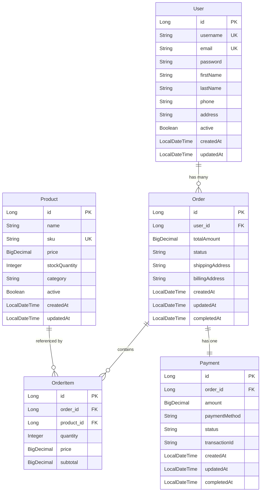
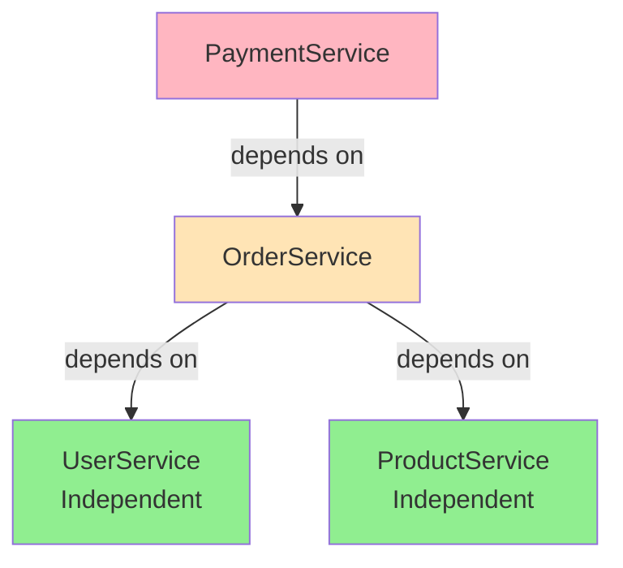
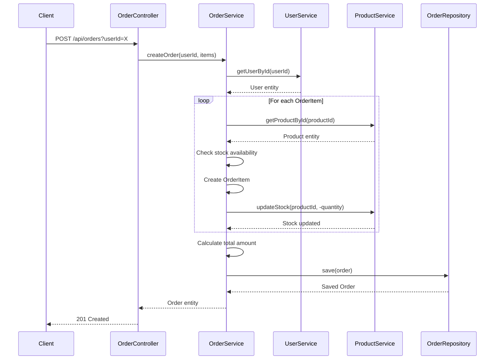
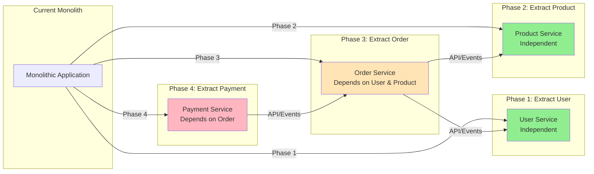

# E-Commerce Monolith: Extended Thinking Analysis

## Executive Summary

This monolithic Spring Boot application demonstrates a typical e-commerce system with four core business domains: User Management, Product Catalog, Order Processing, and Payment Processing. The application follows a layered architecture pattern but exhibits tight coupling between components, making it an ideal candidate for modularization.

---

## 1. Main Components

### 1.1 User Management Module
**Purpose**: User registration, authentication, and profile management

**Components**:
- **Entity**: `User` - Stores user information (username, email, password, profile data)
- **Repository**: `UserRepository` - Data access layer with custom queries
- **Service**: `UserService` - Business logic for user operations
- **Controller**: `UserController` - REST API endpoints (`/api/users`)

**Key Features**:
- User CRUD operations
- Username/email uniqueness validation
- User activation/deactivation
- Profile management

**Dependencies**: None (most independent module)

---

### 1.2 Product Catalog Module
**Purpose**: Product management, inventory tracking, and search functionality

**Components**:
- **Entity**: `Product` - Stores product information (name, SKU, price, stock, category)
- **Repository**: `ProductRepository` - Data access with category and search queries
- **Service**: `ProductService` - Business logic for product operations
- **Controller**: `ProductController` - REST API endpoints (`/api/products`)

**Key Features**:
- Product CRUD operations
- SKU uniqueness validation
- Stock management
- Category-based filtering
- Product search
- Active/inactive product status

**Dependencies**: None (independent module)

---

### 1.3 Order Processing Module
**Purpose**: Shopping cart management, order creation, and order lifecycle management

**Components**:
- **Entities**: 
  - `Order` - Main order entity with status tracking
  - `OrderItem` - Line items within an order
- **Repository**: `OrderRepository` - Data access with user and status queries
- **Service**: `OrderService` - Business logic for order operations
- **Controller**: `OrderController` - REST API endpoints (`/api/orders`)

**Key Features**:
- Order creation with multiple items
- Order status management (PENDING → CONFIRMED → PROCESSING → SHIPPED → DELIVERED)
- Order cancellation with stock restoration
- Order history by user
- Automatic total calculation

**Dependencies**: 
- **UserService** (for user validation)
- **ProductService** (for product validation and stock management)
- Direct entity relationships: `Order` → `User`, `OrderItem` → `Product`

---

### 1.4 Payment Processing Module
**Purpose**: Payment gateway integration and transaction management

**Components**:
- **Entity**: `Payment` - Stores payment information and transaction details
- **Repository**: `PaymentRepository` - Data access layer
- **Service**: `PaymentService` - Business logic for payment operations
- **Controller**: `PaymentController` - REST API endpoints (`/api/payments`)

**Key Features**:
- Payment creation linked to orders
- Payment processing simulation
- Payment status management (PENDING → PROCESSING → COMPLETED/FAILED)
- Refund processing
- Transaction ID generation
- Order status updates on payment completion

**Dependencies**:
- **OrderService** (for order validation and status updates)
- Direct entity relationship: `Payment` → `Order` (OneToOne)

---

## 2. Component Interactions

### 2.1 Entity Relationship Diagram

### 2.2 Service Layer Dependencies

### 2.3 Key Interaction Patterns

#### Order Creation Flow

**Step-by-step breakdown:**
1. **OrderController** receives request with `userId` and `OrderItem` list
2. **OrderService.createOrder()**:
   - Validates user exists via `UserService.getUserById()`
   - For each item:
     - Validates product exists via `ProductService.getProductById()`
     - Checks stock availability
     - Creates `OrderItem` with product price snapshot
     - Updates stock via `ProductService.updateStock()`
   - Calculates total amount
   - Saves order

#### Payment Processing Flow
1. **PaymentController** receives payment creation request
2. **PaymentService.createPayment()**:
   - Validates order exists via `OrderService.getOrderById()`
   - Creates payment record
3. **PaymentService.processPayment()**:
   - Simulates gateway processing
   - Updates payment status
   - Updates order status via `OrderService.updateOrderStatus()`

#### Order Cancellation Flow
1. **OrderService.cancelOrder()**:
   - Validates order can be cancelled
   - Restores stock for each item via `ProductService.updateStock()`
   - Updates order status to CANCELLED

---

## 3. Database Schema Relationships

### 3.1 Entity Relationships

| Relationship | Type | Entities | Notes |
|-------------|------|----------|-------|
| Order → User | ManyToOne | Order.user | Required, non-null |
| OrderItem → Order | ManyToOne | OrderItem.order | Required, cascade delete |
| OrderItem → Product | ManyToOne | OrderItem.product | Required, references product |
| Payment → Order | OneToOne | Payment.order | Required, unique constraint |

### 3.2 Shared Database Concerns

- **Single Database**: All entities share the same H2 in-memory database
- **Transaction Boundaries**: Services use `@Transactional` but transactions span multiple modules
- **Data Consistency**: No clear module boundaries for data isolation
- **Concurrency**: Stock updates could have race conditions without proper locking

---

## 4. Potential Areas for Modularization

### 4.1 Module Boundaries (Recommended)

#### Module 1: User Service
**Boundary**: `com.example.ecommerce.user.*`
- **Includes**: User entity, UserRepository, UserService, UserController
- **Rationale**: 
  - Completely independent
  - No dependencies on other modules
  - Clear domain boundary
- **API**: REST endpoints for user management
- **Database**: Could have separate user database or schema

#### Module 2: Product/Catalog Service
**Boundary**: `com.example.ecommerce.catalog.*` or `com.example.ecommerce.product.*`
- **Includes**: Product entity, ProductRepository, ProductService, ProductController
- **Rationale**:
  - Independent domain
  - No dependencies on other modules
  - Clear business capability
- **API**: REST endpoints for product management
- **Database**: Could have separate catalog database

#### Module 3: Order Service
**Boundary**: `com.example.ecommerce.order.*`
- **Includes**: Order entity, OrderItem entity, OrderRepository, OrderService, OrderController
- **Rationale**:
  - Core business domain
  - Orchestrates user and product interactions
  - Manages order lifecycle
- **Dependencies**: 
  - User Service (via API or shared library)
  - Product Service (via API or shared library)
- **API**: REST endpoints for order management
- **Database**: Separate order database with references to user/product IDs

#### Module 4: Payment Service
**Boundary**: `com.example.ecommerce.payment.*`
- **Includes**: Payment entity, PaymentRepository, PaymentService, PaymentController
- **Rationale**:
  - Specialized domain with external integrations
  - Clear separation of concerns
  - Different scalability requirements
- **Dependencies**: Order Service (via API)
- **API**: REST endpoints for payment processing
- **Database**: Separate payment database with order reference

---

### 4.2 Modularization Strategy

#### Phase 1: Extract User Module (Easiest)
- **Complexity**: Low
- **Risk**: Low
- **Dependencies**: None
- **Benefits**: 
  - Immediate independence
  - Can be deployed separately
  - Clear example for other extractions

#### Phase 2: Extract Product/Catalog Module
- **Complexity**: Low-Medium
- **Risk**: Low
- **Dependencies**: None
- **Benefits**:
  - Independent scaling
  - Separate product database
  - Clear domain boundary

#### Phase 3: Extract Order Module
- **Complexity**: Medium-High
- **Risk**: Medium
- **Dependencies**: User Service, Product Service
- **Challenges**:
  - Replace direct service calls with API calls or events
  - Handle distributed transactions
  - Manage stock updates across services
- **Benefits**:
  - Independent order processing
  - Better scalability
  - Clear order domain

#### Phase 4: Extract Payment Module
- **Complexity**: Medium
- **Risk**: Medium
- **Dependencies**: Order Service
- **Challenges**:
  - Replace direct OrderService calls with API calls
  - Handle payment-order synchronization
- **Benefits**:
  - Independent payment processing
  - Easier to integrate multiple payment gateways
  - Compliance and security isolation

---

### 4.3 Shared Components to Extract

#### Common Library/Module
**Potential Contents**:
- **Common Entities**: Base entity with `id`, `createdAt`, `updatedAt`
- **Common Utilities**: Validation helpers, date utilities
- **Common DTOs**: Response wrappers, error DTOs
- **Common Configuration**: Cross-cutting concerns

**Rationale**: 
- Reduces duplication
- Ensures consistency
- Shared by all modules

---

### 4.4 Integration Patterns for Modularization

#### Option 1: Synchronous REST APIs
- **Pros**: Simple, immediate consistency
- **Cons**: Tight coupling, network latency, failure propagation
- **Use Case**: Order → User/Product validation

#### Option 2: Asynchronous Events
- **Pros**: Loose coupling, better scalability, resilience
- **Cons**: Eventual consistency, complexity
- **Use Case**: Order created → Payment notification, Stock updates

#### Option 3: Shared Database (Anti-pattern)
- **Pros**: Immediate consistency, simple
- **Cons**: Tight coupling, shared schema changes
- **Use Case**: Not recommended for true modularization

---

## 5. Current Architecture Issues

### 5.1 Tight Coupling
- **Service-to-Service Dependencies**: Direct Java method calls
- **Entity Relationships**: JPA relationships create tight coupling
- **Transaction Boundaries**: Transactions span multiple modules

### 5.2 Scalability Concerns
- **Single Deployment Unit**: All modules scale together
- **Database Bottleneck**: Single database for all domains
- **No Independent Scaling**: Cannot scale payment processing independently

### 5.3 Maintainability Issues
- **No Clear Boundaries**: Changes in one module can affect others
- **Shared Schema**: Database changes require coordination
- **Testing Complexity**: Hard to test modules in isolation

### 5.4 Data Consistency Challenges
- **Stock Updates**: Race conditions possible without proper locking
- **Order-Payment Synchronization**: No clear consistency guarantees
- **Cross-Module Transactions**: Complex rollback scenarios

---

## 6. Recommendations

### 6.1 Immediate Improvements (Before Modularization)
1. **Add Transaction Management**: Explicit transaction boundaries
2. **Add Locking**: Optimistic/pessimistic locking for stock updates
3. **Add Validation**: More comprehensive input validation
4. **Add Error Handling**: Consistent error handling across services
5. **Add Logging**: Structured logging for debugging

### 6.2 Modularization Roadmap
1. **Phase 1**: Extract User Module (Low risk, high learning value)
2. **Phase 2**: Extract Product Module (Low risk)
3. **Phase 3**: Extract Order Module (Medium risk, requires integration patterns)
4. **Phase 4**: Extract Payment Module (Medium risk)
5. **Phase 5**: Create Shared Library (Ongoing)

### 6.3 Technology Considerations
- **API Gateway**: For routing and authentication
- **Service Discovery**: For service-to-service communication
- **Message Broker**: For asynchronous events (Kafka, RabbitMQ)
- **Distributed Tracing**: For debugging across services
- **API Documentation**: OpenAPI/Swagger for each service

---

## 7. Conclusion

This monolithic e-commerce application demonstrates typical characteristics that make it suitable for modularization:

- **Clear Domain Boundaries**: Four distinct business domains
- **Dependency Hierarchy**: Clear dependency flow (User/Product → Order → Payment)
- **Independent Capabilities**: User and Product modules are already independent
- **Integration Points**: Well-defined interaction patterns

The modularization effort should focus on:
1. **Extracting independent modules first** (User, Product)
2. **Establishing integration patterns** (REST APIs, events)
3. **Extracting dependent modules** (Order, Payment)
4. **Creating shared components** (common library)

This analysis provides a foundation for planning and executing the modularization strategy.

