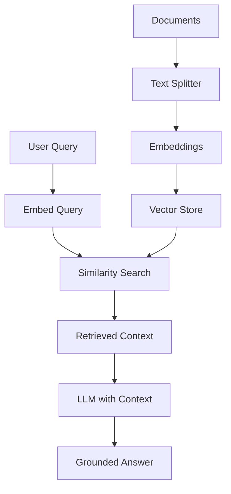
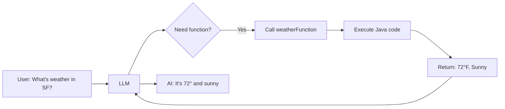
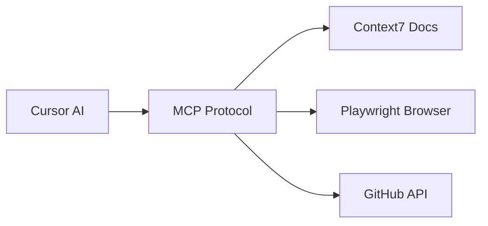

# Session 5: Building AI-Powered Java Apps

**Spring AI, RAG, Tools, and MCP**

<div class="pt-12">
  <span @click="$slidev.nav.next" class="px-2 py-1 rounded cursor-pointer" hover="bg-white bg-opacity-10">
    Press Space for next page <carbon:arrow-right class="inline"/>
  </span>
</div>

<div class="abs-br m-6 flex gap-2">
  <button @click="$slidev.nav.openInEditor()" title="Open in Editor" class="text-xl slidev-icon-btn opacity-50 !border-none !hover:text-white">
    <carbon:edit />
  </button>
</div>

---
layout: center
class: text-center
---

# Welcome to Session 5!

## Building AI-Powered Java Applications

**From Spring Boot to Spring AI**

<div class="pt-12">
  <span class="px-2 py-1">
    Spring Boot 3.5 + Spring AI 1.1.0 + Java 21
  </span>
</div>

---
layout: default
---

# What We'll Build Today

<v-clicks>

- **Spring AI ChatClient** - Fluent API for LLM interactions
- **Prompt Templates** - Reusable, parameterized prompts
- **RAG Pipeline** - Chat with your documents
- **Function Calling** - Give AI tools to execute code
- **MCP Integration** - Enhanced context for Cursor

</v-clicks>

---

# Course Journey

<v-clicks>

- **Session 1:** Cursor fundamentals
- **Session 2:** Mobile development with AI
- **Session 3:** Agentic coding patterns
- **Session 4:** AI-assisted testing
- **Session 5:** Building AI apps with Spring AI ← **Today**

</v-clicks>

---

# Today's Stack

**Spring Boot 3.5.7** • **Spring AI 1.1.0** • **Java 21**

<v-clicks>

- OpenAI or Anthropic API keys required
- All code available in `spring-ai-demo/` folder
- Labs guide you through each feature

</v-clicks>

---
layout: image-right
image: https://images.unsplash.com/photo-1677442136019-21780ecad995?w=800
---

# Part 1: Introduction to Spring AI

**The Spring Way to Build AI Applications**

<v-clicks>

- Official Spring project for AI integration
- Portable abstraction over AI providers
- Familiar Spring programming model

</v-clicks>

---
layout: default
---

# What is Spring AI?

<v-clicks>

- **Official Spring Project** for AI integration
- **Portable abstraction** over AI providers
- **Spring Boot auto-configuration**
- **Familiar Spring programming model**

</v-clicks>

---

# Spring AI Core Components

<v-clicks>

- **ChatClient:** Fluent API for LLM interactions
- **Embeddings:** Vector representations of text
- **Vector Stores:** Storage for document embeddings
- **Function Calling:** Tools that AI can invoke
- **Document Readers:** PDF, Word, text processing

</v-clicks>

---

# Spring AI Advantages

<v-clicks>

- Switch between OpenAI, Anthropic, Ollama without code changes
- Dependency injection for AI components
- Spring Boot conventions and auto-configuration
- Familiar patterns: RestTemplate → ChatClient

</v-clicks>

---
layout: default
---

# Spring AI Gradle Dependencies

```groovy
plugins {
    id 'java'
    id 'org.springframework.boot' version '3.5.7'
    id 'io.spring.dependency-management' version '1.1.7'
}

ext {
    set('springAiVersion', "1.1.0")
}

dependencies {
    implementation 'org.springframework.ai:spring-ai-starter-model-openai'
}

dependencyManagement {
    imports {
        mavenBom "org.springframework.ai:spring-ai-bom:${springAiVersion}"
    }
}
```

---

# Spring AI Configuration

```properties
# application.properties
spring.ai.openai.api-key=${OPENAI_API_KEY}
spring.ai.openai.chat.options.model=gpt-5-nano
spring.ai.openai.chat.options.temperature=1.0
```

<v-clicks>

- Set `OPENAI_API_KEY` environment variable
- Or use `.env` file with Spring Boot
- Alternative: Use Anthropic with `spring-ai-anthropic`

</v-clicks>

---
layout: image-left
image: https://images.unsplash.com/photo-1517694712202-14dd9538aa97?w=800
---

# Part 2: Chat Client & Templating

**Fluent API for LLM Interactions**

<v-clicks>

- Build requests with fluent builder pattern
- System and user message configuration
- Prompt templates for reusable prompts

</v-clicks>

---
layout: default
---

# ChatClient Basics

```java
@RestController
@RequestMapping("/api/chat")
public class ChatController {

    private final ChatClient chatClient;

    public ChatController(ChatClient.Builder builder) {
        this.chatClient = builder.build();
    }

    @GetMapping
    public String chat(@RequestParam String message) {
        return chatClient.prompt()
            .user(message)
            .call()
            .content();
    }
}
```

---

# ChatClient Features

<v-clicks>

- **Fluent API** for building requests
- **System and user messages** configuration
- **Response parsing** and handling
- **Streaming responses** (optional)

</v-clicks>

**Agent Mode Prompt:**
```
Create a ChatController with a GET endpoint /chat.
Inject ChatClient.Builder and return LLM response.
```

---
layout: default
---

# System Prompts

```java
@GetMapping("/expert")
public String expertChat(@RequestParam String topic) {
    return chatClient.prompt()
        .system("""
            You are an expert software architect
            specializing in Spring Boot applications.
            Provide concise, practical advice.
            """)
        .user("How do I implement " + topic)
        .call()
        .content();
}
```

---

# Structured Responses

```java
record BookReview(String title, int rating, String summary) {}

@GetMapping("/review")
public BookReview getBookReview(@RequestParam String book) {
    return chatClient.prompt()
        .user("Write a review of the book: " + book)
        .call()
        .entity(BookReview.class);
}
```

**Spring AI automatically:** Generates JSON schema → Instructs LLM → Parses to Java object

---
layout: default
---

# Prompt Templates

**Template File:** `src/main/resources/prompts/joke.st`

```text
Tell me a {style} joke about {topic}.
Make it appropriate for a professional audience.
```

**Key Points:**
- StringTemplate format (.st files)
- Variable substitution with `{variableName}`
- Version control your prompts

---

# Using Prompt Templates

```java
@GetMapping("/joke")
public String tellJoke(
    @RequestParam String topic,
    @RequestParam(defaultValue = "funny") String style) {

    return chatClient.prompt()
        .user(u -> u.text(
            "classpath:/prompts/joke.st",
            Map.of("topic", topic, "style", style)
        ))
        .call()
        .content();
}
```

---
layout: default
---

# Student Exercise: Chat Interface

**Time:** 10 minutes

<v-clicks>

1. **Create** a new controller
2. **Inject** ChatClient.Builder
3. **Add** a system prompt for your domain
4. **Create** a template for common queries
5. **Test** with various inputs

</v-clicks>

---

# Challenge Ideas

<v-clicks>

- **Code reviewer** - Analyze Java code snippets
- **Documentation generator** - Create JavaDoc
- **SQL translator** - Natural language to SQL
- **Tech explainer** - Simplify complex topics

</v-clicks>

**Bonus:** Use `.entity()` to return structured responses as Java records

---
layout: image-right
image: https://images.unsplash.com/photo-1451187580459-43490279c0fa?w=800
---

# Part 3: Retrieval Augmented Generation (RAG)

**Chat with Your Documents**

<v-clicks>

- Ground AI responses in your data
- Vector stores for semantic search
- Document chunking and embeddings

</v-clicks>

---
layout: default
---

# Why RAG?

<v-clicks>

- **Ground AI in your data** - Not just training data
- **Prevent hallucinations** - Provide context
- **Domain-specific knowledge** - Your documents, policies, code
- **Up-to-date information** - Add new docs anytime

</v-clicks>

---

# RAG Pipeline



---

# RAG Key Concepts

<v-clicks>

- **Chunking:** Split documents into manageable pieces
- **Embeddings:** Convert text to vectors (meaning as numbers)
- **Vector Similarity:** Find chunks semantically similar to query
- **Context Injection:** Add retrieved chunks to LLM prompt

</v-clicks>

---
layout: default
---

# Document Ingestion

```java
@Component
public class DocumentLoader implements CommandLineRunner {

    private final VectorStore vectorStore;

    public DocumentLoader(VectorStore vectorStore) {
        this.vectorStore = vectorStore;
    }

    @Override
    public void run(String... args) {
        Resource resource = new ClassPathResource("documents/policy.txt");
        TextSplitter splitter = new TokenTextSplitter();
        List<Document> documents = splitter.split(new TextReader(resource).get());
```

---

# Document Ingestion (continued)

```java
        // Generate embeddings and store
        vectorStore.add(documents);
        log.info("Loaded {} documents", documents.size());
    }
}
```

<v-clicks>

**What Happens:**
1. Load `policy.txt` from classpath
2. Split into ~500 token chunks
3. Generate embeddings (via OpenAI)
4. Store vectors in SimpleVectorStore

</v-clicks>

---
layout: default
---

# SimpleVectorStore (In-Memory)

```java
@Configuration
public class VectorStoreConfig {

    @Bean
    public VectorStore vectorStore(EmbeddingModel embeddingModel) {
        return SimpleVectorStore.builder(embeddingModel).build();
    }
}
```

**Good for:** Development, testing, small document sets, prototypes

---

# Production Vector Stores

<v-clicks>

- **Chroma** - Open source, easy setup
- **Pinecone** - Managed service
- **PgVector** - PostgreSQL extension
- **Redis** - If already using Redis

</v-clicks>

```java
@Bean
public VectorStore vectorStore(JdbcTemplate jdbc, EmbeddingModel model) {
    return new PgVectorStore(jdbc, model);
}
```

---
layout: default
---

# RAG with QuestionAnswerAdvisor

Spring AI provides the `QuestionAnswerAdvisor` to handle RAG automatically:

```java
@RestController
@RequestMapping("/api/rag")
public class RagController {

    private final ChatClient chatClient;

    public RagController(ChatClient.Builder builder, VectorStore vectorStore) {
        this.chatClient = builder
            .defaultAdvisors(
                QuestionAnswerAdvisor.builder(vectorStore)
                    .searchRequest(SearchRequest.builder().topK(5).build())
                    .build())
            .build();
    }
```

---

# RAG Query - Simple!

```java
    @GetMapping("/query")
    public String query(@RequestParam String question) {
        return chatClient.prompt()
            .user(question)
            .call()
            .content();
    }
}
```

**The Advisor handles:** similarity search, context injection, prompt augmentation

---

# QuestionAnswerAdvisor Benefits

<v-clicks>

- **No manual search** - Advisor queries vector store automatically
- **Context injection** - Retrieved documents added to prompt
- **Configurable** - Set topK, similarity threshold, filters
- **Clean code** - Controller stays simple

</v-clicks>

---
layout: default
---

# Chunking Strategies

<v-clicks>

- **TokenTextSplitter** - By token count (most common)
- **Paragraph splitter** - Natural boundaries
- **Sliding window** - Overlap for continuity

</v-clicks>

**Sweet spot:** 300-800 tokens with 10-20% overlap

---

# Search Configuration

```java
SearchRequest.query(question)
    .withTopK(5)                   // Return top 5 matches
    .withSimilarityThreshold(0.7)  // Min similarity
    .withFilterExpression("type == 'policy'");  // Metadata filter
```

<v-clicks>

- Explicitly tell AI to use context
- Handle "I don't know" gracefully
- Test with questions not in docs

</v-clicks>

---
layout: default
---

# Student Exercise: RAG Pipeline

**Time:** 20 minutes

<v-clicks>

1. **Create** sample documents in `src/main/resources/documents/`
2. **Configure** VectorStore bean
3. **Implement** DocumentLoader
4. **Create** RAG endpoint
5. **Test** with queries requiring document knowledge

</v-clicks>

---

# RAG Challenge Ideas

<v-clicks>

- **Company policies** - HR handbook, procedures
- **Technical docs** - API documentation
- **Knowledge base** - FAQ, troubleshooting

</v-clicks>

**Bonus:** Add metadata (author, date) and filter search results

---
layout: center
class: text-center
---

# BREAK

**10 minutes**

<div class="pt-12">
  <span class="px-2 py-1">
    Grab coffee before we dive into function calling!
  </span>
</div>

---
layout: image-left
image: https://images.unsplash.com/photo-1555066931-4365d14bab8c?w=800
---

# Part 4: Tools & Function Calling

**Give AI the Ability to Execute Code**

<v-clicks>

- AI decides when to call functions
- Structured output for function invocation
- Multi-step workflow automation

</v-clicks>

---
layout: default
---

# What is Function Calling?

<v-clicks>

- **AI decides** when to call functions
- **Structured output** from LLM (function name + args)
- **Your code executes** the function
- **Return result** to AI for response

</v-clicks>

---

# Function Calling Flow



---

# Function Calling Use Cases

<v-clicks>

- **Database lookups** - Query data
- **API calls** - External services
- **Calculations** - Math, business logic
- **Workflow automation** - Multi-step tasks

</v-clicks>

**Key:** AI can call your Java methods based on natural language!

---
layout: default
---

# Defining Tools with @Tool Annotation

```java
import org.springframework.ai.tool.annotation.Tool;
import org.springframework.ai.tool.annotation.ToolParam;

@Component
public class WeatherTools {

    public record WeatherResponse(
        String location, String temperature, String description) {}
```

- Tools are Spring `@Component` beans
- Define response types as records
- Import `@Tool` and `@ToolParam` annotations

---

# @Tool Method Definition

```java
    @Tool(description = "Get current weather for a location. "
        + "Use when user asks about weather conditions.")
    public WeatherResponse getCurrentWeather(
            @ToolParam(description = "City and state, e.g. 'San Francisco, CA'")
            String location,
            @ToolParam(description = "Unit: 'celsius' or 'fahrenheit'",
                       required = false)
            String unit) {
        String temp = "celsius".equalsIgnoreCase(unit) ? "22°C" : "72°F";
        return new WeatherResponse(location, temp, "Sunny with light clouds");
    }
}
```

---

# @Tool Annotation Benefits

<v-clicks>

- **Declarative** - Mark methods directly with `@Tool`
- **Type-safe** - Use primitives, records, lists, maps
- **Self-documenting** - `@ToolParam` describes each parameter
- **Spring integrated** - Tools are just `@Component` beans

</v-clicks>

---
layout: default
---

# Register Tools with ChatClient

```java
@RestController
@RequestMapping("/api/tools")
public class ToolController {

    private final ChatClient chatClient;

    public ToolController(ChatClient.Builder builder, WeatherTools weatherTools) {
        this.chatClient = builder
            .defaultTools(weatherTools)  // Register all @Tool methods
            .build();
    }

    @GetMapping("/chat")
    public String chat(@RequestParam String message) {
        return chatClient.prompt().user(message).call().content();
    }
}
```

---

# Function Calling in Action

**User:** "What's the weather in San Francisco?"

<v-clicks>

1. AI recognizes need for `weatherFunction`
2. Extracts location: "San Francisco"
3. Calls your Java function
4. Receives: 72°F, Sunny
5. Responds: "It's currently 72°F and sunny..."

</v-clicks>

---
layout: default
---

# Database Access with @Tool

```java
@Component
public class CustomerTools {

    public record Customer(Long id, String name, String email, String tier) {}

    private final Map<String, Customer> customers = Map.of(
        "alice@example.com", new Customer(1L, "Alice Smith", "alice@example.com", "Gold"),
        "bob@example.com", new Customer(2L, "Bob Jones", "bob@example.com", "Silver")
    );
```

Tools can access any Spring-managed resource: repositories, services, APIs

---

# CustomerTools @Tool Method

```java
    @Tool(description = "Find a customer by email address")
    public Customer findCustomerByEmail(
            @ToolParam(description = "Customer's email address") String email) {
        return customers.getOrDefault(email,
            new Customer(null, "Unknown", email, "Not Found"));
    }
}
```

**Key:** Description tells AI when to call this tool

---

# Multiple Tools in One Class

```java
@Component
public class CustomerTools {
    // ... findCustomerByEmail from above ...

    @Tool(description = "List all customers in a membership tier. "
        + "Valid tiers: Gold, Silver, Bronze")
    public List<Customer> getCustomersByTier(
            @ToolParam(description = "Membership tier") String tier) {
        return customers.values().stream()
            .filter(c -> c.tier().equalsIgnoreCase(tier))
            .toList();
    }
}
```

**Register multiple tool classes:** `.defaultTools(weatherTools, customerTools)`

---
layout: default
---

# Tool Design Best Practices

<v-clicks>

- **Clear descriptions** - Tell AI *when* to use this tool
- **Document parameters** - Use `@ToolParam` with format examples
- **Handle errors gracefully** - Return error info, don't throw
- **Keep tools focused** - One tool, one job

</v-clicks>

---

# Good @Tool Description Examples

```java
@Tool(description = "Get customer by email. Returns name, email, tier if found.")

@Tool(description = "Calculate order total including tax. "
    + "Use when user asks about pricing or totals.")

@Tool(description = "Send email notification to a user. "
    + "Returns success/failure status. Use for confirmations.")
```

**Key:** Describe *when* the AI should call the tool

---

# Security Considerations

<v-clicks>

- **Authentication** - Verify user context
- **Authorization** - Check permissions
- **Input validation** - Sanitize all inputs
- **Audit logging** - Track tool calls

</v-clicks>

```java
@Tool(description = "Get order details by ID")
public OrderResponse getOrder(
        @ToolParam(description = "Order ID") String orderId,
        ToolContext toolContext) {
    String userId = (String) toolContext.getContext().get("userId");
    securityService.checkPermission(userId, "orders:read");
    return orderService.getOrder(orderId);
}
```

---
layout: default
---

# Student Exercise: Custom Tools

**Time:** 20 minutes

<v-clicks>

1. **Choose** a domain (e-commerce, HR, etc.)
2. **Create** a Tools class with `@Component`
3. **Add** `@Tool` methods with clear descriptions
4. **Use** `@ToolParam` for parameter documentation
5. **Register** with `.defaultTools()` and test!

</v-clicks>

---

# Tool Challenge Ideas

<v-clicks>

- **Calculator** - Math operations with unit conversion
- **Time tools** - Timezone conversion, date formatting
- **Currency exchange** - Convert between currencies
- **Order management** - createOrder, getStatus, cancelOrder

</v-clicks>

**Bonus:** Create multiple related `@Tool` methods in one class!

---
layout: image-right
image: https://images.unsplash.com/photo-1558494949-ef010cbdcc31?w=800
---

# Part 5: Model Context Protocol (MCP)

**Enhanced Context for Cursor**

<v-clicks>

- Protocol for connecting AI to external data
- Real-time database schema awareness
- Tool discovery and dynamic resources

</v-clicks>

---
layout: default
---

# What is MCP?

<v-clicks>

- **Protocol** for connecting AI to external data
- **Cursor's MCP support** - Enhanced context in Cursor
- **Standard interface** for tool integration
- **Resources** - Files, databases, APIs

</v-clicks>

---

# MCP Architecture



---

# MCP Benefits

<v-clicks>

- **Real-time context** - Current database schema
- **Dynamic resources** - Access live data
- **Better suggestions** - More accurate code generation
- **Reduced hallucinations** - Grounded in actual data

</v-clicks>

---
layout: default
---

# MCP Setup in Cursor

**Step 1:** Cursor → Settings → Features → MCP (or `Cmd+Shift+J`)

```json
{
  "mcpServers": {
    "context7": {
      "command": "npx",
      "args": ["-y", "@upstash/context7-mcp"]
    }
  }
}
```

**Step 2:** Restart Cursor

---

# Why Context7?

<v-clicks>

- **Live documentation** - Always up-to-date library docs
- **No API keys** - Works out of the box
- **Perfect for learning** - Look up Spring AI docs as you code!

</v-clicks>

**Try:** "Using context7, look up Spring AI ChatClient documentation"

---

# Available MCP Servers

<v-clicks>

- `@upstash/context7-mcp` - Live library documentation
- `@anthropic/mcp-server-fetch` - Web page fetching
- `@anthropic/mcp-server-playwright` - Browser automation
- `@anthropic/mcp-server-github` - GitHub API integration
- `@anthropic/mcp-server-filesystem` - Local file access

</v-clicks>

**Explore more:** [github.com/modelcontextprotocol/servers](https://github.com/modelcontextprotocol/servers)

---
layout: default
---

# MCP + Spring AI Development

**Use Context7 while building Spring AI apps:**

```
"Using context7, show me the latest QuestionAnswerAdvisor API"

"What's the current syntax for @Tool annotations in Spring AI?"

"How do I configure SimpleVectorStore in Spring AI 1.1.0?"
```

<v-clicks>

- Get current API docs, not outdated training data
- Verify your code matches latest patterns
- Learn new features as you build

</v-clicks>

---

# MCP Use Cases

<v-clicks>

- **Documentation lookup** - Current API references while coding
- **Code generation** - Accurate, up-to-date patterns
- **Browser testing** - Interact with running apps (Playwright)
- **Multi-library projects** - Get docs for any dependency

</v-clicks>

---
layout: default
---

# Student Exercise: MCP Exploration

**Time:** 10 minutes

<v-clicks>

1. **Open** Cursor Settings → Features → MCP
2. **Add** Context7 MCP server
3. **Restart** Cursor
4. **Test:** "Using context7, look up Spring AI RAG documentation"

</v-clicks>

---

# MCP Exploration Questions

<v-clicks>

- How do answers differ with vs without Context7?
- Can you get current Spring AI 1.1.0 API details?
- Does Cursor generate more accurate code?
- What other documentation would be useful?

</v-clicks>

**Try:** "Using context7, what's new in Spring AI 1.1.0?"

---
layout: image-left
image: https://images.unsplash.com/photo-1486406146926-c627a92ad1ab?w=800
---

# Part 6: Legacy Modernization with AI

**Applying AI Patterns to Legacy Code**

<v-clicks>

- AI-assisted code analysis
- Incremental refactoring strategies
- Adding AI capabilities to existing systems

</v-clicks>

---
layout: default
---

# Legacy Code Analysis

```java
// Legacy OrderService (Spring Boot 2.7)
@Service
public class OrderService {
    @Autowired private OrderRepository orderRepo;
    @Autowired private UserRepository userRepo;

    public void processOrder(Long orderId) throws Exception {
        Order order = orderRepo.findById(orderId).orElseThrow();
        // Complex business logic, no error handling, hard to test
    }
}
```

---

# AI Identifies Issues

<v-clicks>

- Field injection anti-pattern
- Missing validation
- Poor error handling
- No transaction management
- Opportunities for AI enhancement

</v-clicks>

**Prompt:** "Analyze this legacy OrderService and create a migration plan"

---
layout: default
---

# Step 1: Constructor Injection

```java
public OrderService(OrderRepository orderRepo, UserRepository userRepo) {
    this.orderRepo = orderRepo;
    this.userRepo = userRepo;
}
```

---

# Step 2: Proper Error Handling

```java
public Order processOrder(Long orderId) {
    return orderRepo.findById(orderId)
        .map(this::validateAndProcess)
        .orElseThrow(() -> new OrderNotFoundException(orderId));
}
```

---

# Step 3: Add AI Capabilities

```java
public OrderAnalysisReport analyzeOrder(Long orderId) {
    Order order = getOrder(orderId);

    return chatClient.prompt()
        .system("Analyze order for risks")
        .user(toJson(order))
        .call()
        .entity(OrderAnalysisReport.class);
}
```

---
layout: default
---

# Student Exercise: Legacy Analysis

**Time:** 10 minutes - Use Extended Thinking to explore:

<v-clicks>

1. "What are the main testing challenges in this legacy codebase?"
2. "How would you prioritize testing improvements?"
3. "What risks should be considered when adding tests?"

</v-clicks>

---

# AI-Powered Modernization

<v-clicks>

- Identify code smells and anti-patterns
- Suggest refactoring strategies
- Generate tests for legacy code
- Add AI capabilities to existing features

</v-clicks>

**AI suggests:** RAG for policy lookup, function calling for external services

---
layout: section
---

# Wrap-Up & Next Steps

**Course Completion**

---
layout: default
---

# Spring AI Decision Tree

<v-clicks>

- **Chat interface?** → Use ChatClient with templates
- **Chat with your data?** → Implement RAG pipeline
- **AI execute code?** → Use function calling
- **Enhanced context?** → Configure MCP

</v-clicks>

---

# What We Accomplished

<v-clicks>

- ✅ Spring AI application setup
- ✅ ChatClient with prompt templates
- ✅ RAG pipeline for document Q&A
- ✅ Function calling with Spring AI tools
- ✅ MCP exploration for enhanced context

</v-clicks>

---

# Core Pattern

**Spring AI brings AI capabilities with familiar patterns:**

`RestTemplate` → `ChatClient`

`JpaRepository` → `VectorStore`

`@Service` → `@Component` with `@Tool` methods

---
layout: default
---

# The Five-Session Arc

<v-clicks>

- **Session 1:** Cursor fundamentals - Chat, Agent, Composer
- **Session 2:** Mobile development - Kotlin, Jetpack Compose
- **Session 3:** Agentic coding patterns
- **Session 4:** AI-assisted testing - JUnit 5, Mockito, TestContainers
- **Session 5:** Spring AI - RAG, Function Calling, MCP

</v-clicks>

---

# Next Steps

<v-clicks>

- **Apply Spring AI** to your projects
- **Experiment** with different AI providers
- **Build** custom tools for your domain
- **Stay updated** on Spring AI releases

</v-clicks>

---

# Resources

- [Spring AI Docs](https://docs.spring.io/spring-ai/reference/)
- [Spring AI GitHub](https://github.com/spring-projects/spring-ai)
- [Spring AI Examples](https://github.com/spring-projects/spring-ai-examples)
- [MCP Specification](https://modelcontextprotocol.io/)

---
layout: center
class: text-center
---

# Questions & Discussion

<div class="pt-12">
  <span class="px-2 py-1">
    Spring AI • RAG • Function Calling • MCP
  </span>
</div>

<div class="abs-br m-6 flex gap-2">
  <span class="text-sm opacity-50">
    Session 5 Complete
  </span>
</div>

---
layout: center
class: text-center
---

# Thank You!

## Building AI-Powered Java Apps with Spring AI

**You're now equipped to build intelligent Java applications!**

<div class="pt-12">
  <span class="px-2 py-1">
    Ready for the labs? Let's build with Spring AI!
  </span>
</div>

<div class="abs-br m-6 flex gap-2">
  <span class="text-sm opacity-50">
    Spring Boot 3.5 + Spring AI 1.1.0 + Java 21
  </span>
</div>
