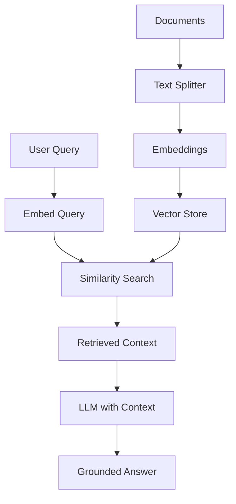
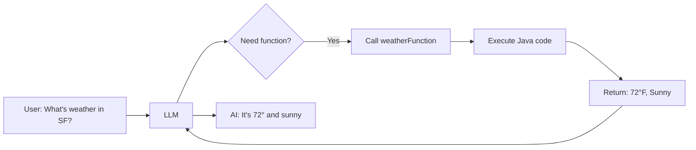
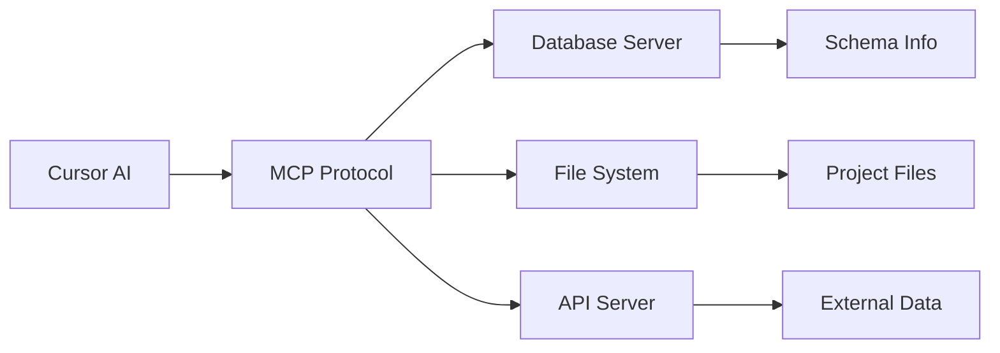

# Session 5: Building AI-Powered Java Apps

**Spring AI, RAG, Tools, and MCP**

<div class="pt-12">
  <span @click="$slidev.nav.next" class="px-2 py-1 rounded cursor-pointer" hover="bg-white bg-opacity-10">
    Press Space for next page <carbon:arrow-right class="inline"/>
  </span>
</div>

<div class="abs-br m-6 flex gap-2">
  <button @click="$slidev.nav.openInEditor()" title="Open in Editor" class="text-xl slidev-icon-btn opacity-50 !border-none !hover:text-white">
    <carbon:edit />
  </button>
</div>

---
layout: center
class: text-center
---

# Welcome to Session 5!

## Building AI-Powered Java Applications

**From Spring Boot to Spring AI**

<div class="pt-12">
  <span class="px-2 py-1">
    Spring Boot 3.5 + Spring AI 1.1.0 + Java 21
  </span>
</div>

---
layout: default
---

# Session 5 Overview

<div class="grid grid-cols-2 gap-8">

<div>

## What We'll Build Today

<v-clicks>

- **Spring AI ChatClient** - Fluent API for LLM interactions
- **Prompt Templates** - Reusable, parameterized prompts
- **RAG Pipeline** - Chat with your documents
- **Function Calling** - Give AI tools to execute code
- **MCP Integration** - Enhanced context for Cursor

</v-clicks>

</div>

<div>

## Course Journey

<v-clicks>

- **Session 1:** Cursor fundamentals
- **Session 2:** Mobile development with AI
- **Session 3:** Agentic coding patterns
- **Session 4:** AI-assisted testing
- **Session 5:** Building AI apps with Spring AI

</v-clicks>

</div>

</div>

<div class="pt-8">

## Today's Stack

**Spring Boot 3.5.7** • **Spring AI 1.1.0** • **Java 21** • **OpenAI/Anthropic APIs**

</div>

---
layout: image-right
image: https://images.unsplash.com/photo-1677442136019-21780ecad995?w=800
---

# Part 1: Introduction to Spring AI

**The Spring Way to Build AI Applications**

<v-clicks>

- Official Spring project for AI integration
- Portable abstraction over AI providers
- Familiar Spring programming model

</v-clicks>

---
layout: default
---

# What is Spring AI?

<div class="grid grid-cols-2 gap-8">

<div>

## Spring AI Overview

<v-clicks>

- **Official Spring Project** for AI integration
- **Portable abstraction** over AI providers
- **Spring Boot auto-configuration**
- **Familiar Spring programming model**
- **Production-ready** with Spring ecosystem

</v-clicks>

</div>

<div>

## Core Components

<v-clicks>

- **ChatClient:** Fluent API for LLM interactions
- **Embeddings:** Vector representations of text
- **Vector Stores:** Storage for document embeddings
- **Function Calling:** Tools that AI can invoke
- **Document Readers:** PDF, Word, text processing

</v-clicks>

</div>

</div>

<div class="pt-8">

## Spring AI Advantages

<v-clicks>

- Switch between OpenAI, Anthropic, Ollama without code changes
- Dependency injection for AI components
- Spring Boot conventions and auto-configuration
- Familiar patterns: RestTemplate → ChatClient

</v-clicks>

</div>

---
layout: default
---

# Spring AI Project Setup

<div class="grid grid-cols-2 gap-8">

<div>

## Maven Dependencies

```xml {all|3-5|10-13|14-17|all}
<parent>
    <groupId>org.springframework.boot</groupId>
    <artifactId>spring-boot-starter-parent</artifactId>
    <version>3.5.7</version>
</parent>

<properties>
    <java.version>21</java.version>
    <spring-ai.version>1.1.0</spring-ai.version>
</properties>

<dependencies>
    <dependency>
        <groupId>org.springframework.ai</groupId>
        <artifactId>spring-ai-starter-model-openai</artifactId>
    </dependency>
    <dependency>
        <groupId>org.springframework.ai</groupId>
        <artifactId>spring-ai-pdf-document-reader</artifactId>
    </dependency>
</dependencies>
```

</div>

<div>

## Configuration

```properties {all|1|2-3|4-5|all}
# application.properties
spring.ai.openai.api-key=${OPENAI_API_KEY}
spring.ai.openai.chat.options.model=gpt-4o
spring.ai.openai.chat.options.temperature=0.7
spring.ai.openai.chat.options.max-tokens=500
```

<v-clicks>

**Environment Setup:**
- Set `OPENAI_API_KEY` environment variable
- Or use `.env` file (with Spring Boot support)
- Alternative: Use Anthropic with `spring-ai-anthropic`

</v-clicks>

</div>

</div>

---
layout: image-left
image: https://images.unsplash.com/photo-1517694712202-14dd9538aa97?w=800
---

# Part 2: Chat Client & Templating

**Fluent API for LLM Interactions**

<v-clicks>

- Build requests with fluent builder pattern
- System and user message configuration
- Prompt templates for reusable prompts

</v-clicks>

---
layout: default
---

# ChatClient Basics

<div class="grid grid-cols-2 gap-8">

<div>

## Demo: Basic Chat Interaction

```java {all|5-7|9-14|16-19|all}
@RestController
@RequestMapping("/api/chat")
public class ChatController {

    private final ChatClient chatClient;

    public ChatController(ChatClient.Builder builder) {
        this.chatClient = builder.build();
    }

    @GetMapping
    public String chat(@RequestParam String message) {
        return chatClient.prompt()
            .user(message)
            .call()
            .content();
    }
}
```

</div>

<div>

## ChatClient Features

<v-clicks>

- **Fluent API** for building requests
- **System and user messages** configuration
- **Response parsing** and handling
- **Streaming responses** (optional)
- **Error management** built-in

</v-clicks>

<div class="pt-8">

**Agent Mode Prompt:**
```
Create a ChatController with a GET
endpoint /chat. Inject ChatClient.Builder.
Use the ChatClient to send the user's
message to the LLM and return the response.
```

</div>

</div>

</div>

---
layout: default
---

# Advanced ChatClient Features

<div class="grid grid-cols-2 gap-8">

<div>

## System Prompts

```java {all|4-8|10-12|all}
@GetMapping("/expert")
public String expertChat(@RequestParam String topic) {
    return chatClient.prompt()
        .system("""
            You are an expert software architect
            specializing in Spring Boot applications.
            Provide concise, practical advice.
            """)
        .user("How do I implement " + topic)
        .call()
        .content();
}
```

</div>

<div>

## Structured Responses

```java {all|4-5|7-10|all}
record BookReview(String title, int rating, String summary) {}

@GetMapping("/review")
public BookReview getBookReview(@RequestParam String book) {
    return chatClient.prompt()
        .user("Write a review of the book: " + book)
        .call()
        .entity(BookReview.class);
}
```

<v-clicks>

**Spring AI automatically:**
- Generates JSON schema from Java record
- Instructs LLM to respond with JSON
- Parses response into Java object

</v-clicks>

</div>

</div>

---
layout: default
---

# Prompt Templates

<div class="grid grid-cols-2 gap-8">

<div>

## Demo: Template-Based Prompts

**Template File:** `src/main/resources/prompts/joke.st`

```text
Tell me a {style} joke about {topic}.
Make it appropriate for a professional
audience.
```

**Controller:**

```java {all|4-7|9-13|all}
@GetMapping("/joke")
public String tellJoke(
    @RequestParam String topic,
    @RequestParam(defaultValue = "funny") String style) {

    return chatClient.prompt()
        .user(u -> u.text(
            "classpath:/prompts/joke.st",
            Map.of("topic", topic, "style", style)
        ))
        .call()
        .content();
}
```

</div>

<div>

## Template Patterns

<v-clicks>

- **StringTemplate format** (.st files)
- **Variable substitution** with `{variableName}`
- **Organize by purpose** (prompts folder)
- **Reusable across controllers**
- **Version control** your prompts

</v-clicks>

<div class="pt-8">

**Agent Mode Prompt:**
```
Refactor the controller to use a
PromptTemplate. Load the template from
'classpath:/prompts/joke.st'.
The template should accept a 'topic'
variable.
```

</div>

</div>

</div>

---
layout: default
---

# Student Exercise: Chat Interface

<div class="grid grid-cols-2 gap-8">

<div>

## Your Turn: Build a Chat Endpoint

<v-clicks>

1. **Create** a new controller
2. **Inject** ChatClient.Builder
3. **Add** a system prompt for your domain
4. **Create** a template for common queries
5. **Test** with various inputs

</v-clicks>

<div class="pt-8">

**Time:** 10 minutes

</div>

</div>

<div>

## Challenge Ideas

<v-clicks>

- **Code reviewer** - Analyze Java code snippets
- **Documentation generator** - Create JavaDoc
- **Test data generator** - Generate test cases
- **SQL translator** - Natural language to SQL
- **Tech explainer** - Simplify complex topics

</v-clicks>

<div class="pt-8">

**Bonus Challenge:**
Use `.entity()` to return structured responses as Java records

</div>

</div>

</div>

---
layout: image-right
image: https://images.unsplash.com/photo-1451187580459-43490279c0fa?w=800
---

# Part 3: Retrieval Augmented Generation (RAG)

**Chat with Your Documents**

<v-clicks>

- Ground AI responses in your data
- Vector stores for semantic search
- Document chunking and embeddings

</v-clicks>

---
layout: default
---

# Understanding RAG

<div class="grid grid-cols-2 gap-8">

<div>

## Why RAG?

<v-clicks>

- **Ground AI in your data** - Not just training data
- **Prevent hallucinations** - Provide context
- **Domain-specific knowledge** - Your documents, policies, code
- **Up-to-date information** - Add new docs anytime
- **Traceable sources** - Know where answers come from

</v-clicks>

</div>

<div>

## RAG Pipeline



</div>

</div>

<div class="pt-8">

## Key Concepts

<v-clicks>

- **Chunking:** Split documents into manageable pieces
- **Embeddings:** Convert text to vectors (numbers representing meaning)
- **Vector Similarity:** Find chunks semantically similar to query
- **Context Injection:** Add retrieved chunks to LLM prompt

</v-clicks>

</div>

---
layout: default
---

# Document Ingestion

<div class="grid grid-cols-2 gap-8">

<div>

## Demo: Loading Documents

```java {all|7-10|12-14|16-19|21-24|all}
@Component
public class DocumentLoader implements
    CommandLineRunner {

    private final VectorStore vectorStore;

    public DocumentLoader(VectorStore vectorStore) {
        this.vectorStore = vectorStore;
    }

    @Override
    public void run(String... args) {
        // Load document
        Resource resource = new ClassPathResource(
            "documents/policy.txt"
        );

        // Split into chunks
        TextSplitter splitter =
            new TokenTextSplitter();

        List<Document> documents =
            splitter.split(
                new TextReader(resource).get()
            );
```

</div>

<div>

```java {all|2-3|5-6|all}
        // Generate embeddings and store
        vectorStore.add(documents);

        log.info("Loaded {} documents",
                 documents.size());
    }
}
```

<v-clicks>

**What Happens Here:**
1. Load `policy.txt` from classpath
2. Split into ~500 token chunks
3. Generate embeddings (via OpenAI)
4. Store vectors in SimpleVectorStore

</v-clicks>

<div class="pt-8">

**Extended Thinking Prompt:**
```
Create a CommandLineRunner that reads
'policy.txt' from the classpath. Use
TokenTextSplitter to split it into
chunks. Load the chunks into the
SimpleVectorStore.
```

</div>

</div>

</div>

---
layout: default
---

# Vector Store Configuration

<div class="grid grid-cols-2 gap-8">

<div>

## SimpleVectorStore (In-Memory)

```java {all|3-7|9-11|all}
@Configuration
public class VectorStoreConfig {

    @Bean
    public VectorStore vectorStore(
        EmbeddingModel embeddingModel) {
        return new SimpleVectorStore(
            embeddingModel
        );
    }
}
```

<v-clicks>

**Good for:**
- Development and testing
- Small document sets
- Prototypes

</v-clicks>

</div>

<div>

## Production Vector Stores

<v-clicks>

**Spring AI supports:**
- **Chroma** - Open source, easy setup
- **Pinecone** - Managed service
- **Weaviate** - Feature-rich, self-hosted
- **PgVector** - PostgreSQL extension
- **Redis** - If already using Redis

</v-clicks>

<div class="pt-8">

**Example: PgVector**

```java
@Bean
public VectorStore vectorStore(
    JdbcTemplate jdbcTemplate,
    EmbeddingModel embeddingModel) {
    return new PgVectorStore(
        jdbcTemplate,
        embeddingModel
    );
}
```

</div>

</div>

</div>

---
layout: default
---

# RAG Query Implementation

<div class="grid grid-cols-2 gap-8">

<div>

## Demo: RAG Controller

```java {all|7-10|12-16|18-24|all}
@RestController
@RequestMapping("/api/rag")
public class RagController {

    private final ChatClient chatClient;
    private final VectorStore vectorStore;

    public RagController(
        ChatClient.Builder builder,
        VectorStore vectorStore) {
        this.chatClient = builder.build();
        this.vectorStore = vectorStore;
    }

    @GetMapping("/query")
    public String query(@RequestParam String question) {
        // Search for similar documents
        List<Document> similarDocs =
            vectorStore.similaritySearch(
                SearchRequest.query(question)
                    .withTopK(5)
            );
```

</div>

<div>

```java {all|2-7|9-15|17-18|all}
        // Build context from documents
        String context = similarDocs.stream()
            .map(Document::getContent)
            .collect(Collectors.joining("\n\n"));

        // Query LLM with context
        return chatClient.prompt()
            .system("""
                Answer the question based ONLY
                on the provided context.
                If you cannot answer from the
                context, say so.

                Context: {context}
                """)
            .user(question)
            .call()
            .content();
    }
}
```

</div>

</div>

---
layout: default
---

# RAG Best Practices

<div class="grid grid-cols-2 gap-8">

<div>

## Chunking Strategies

<v-clicks>

- **TokenTextSplitter** - By token count (most common)
- **Paragraph splitter** - Natural boundaries
- **Sentence splitter** - Precise context
- **Sliding window** - Overlap for continuity
- **Semantic chunking** - By topic/meaning

</v-clicks>

<div class="pt-8">

**Chunk Size Guidelines:**
- Too small: Loss of context
- Too large: Noise in retrieval
- **Sweet spot:** 300-800 tokens
- **Overlap:** 10-20% recommended

</div>

</div>

<div>

## Search Configuration

```java
SearchRequest.query(question)
    .withTopK(5)              // Return top 5 matches
    .withSimilarityThreshold(0.7) // Min similarity
    .withFilterExpression(     // Metadata filtering
        "type == 'policy' AND year >= 2024"
    );
```

<v-clicks>

**Prompt Engineering for RAG:**
- Explicitly tell AI to use context
- Ask for citations/sources
- Handle "I don't know" gracefully
- Test with questions not in docs

</v-clicks>

</div>

</div>

---
layout: default
---

# Student Exercise: RAG Pipeline

<div class="grid grid-cols-2 gap-8">

<div>

## Your Turn: Implement RAG

<v-clicks>

1. **Create** sample documents in `src/main/resources/documents/`
2. **Configure** VectorStore bean
3. **Implement** DocumentLoader
4. **Create** RAG endpoint
5. **Test** with queries that require document knowledge

</v-clicks>

<div class="pt-8">

**Time:** 20 minutes

</div>

</div>

<div>

## Challenge Ideas

<v-clicks>

- **Company policies** - HR handbook, procedures
- **Technical docs** - API documentation
- **Code analysis** - Index your codebase
- **Product catalog** - Search product info
- **Knowledge base** - FAQ, troubleshooting

</v-clicks>

<div class="pt-8">

**Bonus Challenge:**
- Add metadata to documents (author, date, type)
- Filter search by metadata
- Return sources with answers

</div>

</div>

</div>

---
layout: center
class: text-center
---

# BREAK

**10 minutes**

<div class="pt-12">
  <span class="px-2 py-1">
    Grab coffee before we dive into function calling!
  </span>
</div>

---
layout: image-left
image: https://images.unsplash.com/photo-1555066931-4365d14bab8c?w=800
---

# Part 4: Tools & Function Calling

**Give AI the Ability to Execute Code**

<v-clicks>

- AI decides when to call functions
- Structured output for function invocation
- Multi-step workflow automation

</v-clicks>

---
layout: default
---

# Function Calling Concepts

<div class="grid grid-cols-2 gap-8">

<div>

## What is Function Calling?

<v-clicks>

- **AI decides** when to call functions
- **Structured output** from LLM (function name + args)
- **Your code executes** the function
- **Return result** to AI for response
- **Multi-step workflows** possible

</v-clicks>

<div class="pt-8">

## How It Works



</div>

</div>

<div>

## Use Cases

<v-clicks>

- **Database lookups** - Query data
- **API calls** - External services
- **Calculations** - Math, business logic
- **System operations** - File, process management
- **Workflow automation** - Multi-step tasks

</v-clicks>

<div class="pt-8">

**Key Point:**
AI can now "use tools" - call your Java methods based on natural language requests!

</div>

</div>

</div>

---
layout: default
---

# Simple Tool Implementation

<div class="grid grid-cols-2 gap-8">

<div>

## Demo: Weather Tool

**Step 1: Define Request/Response**

```java {all|1-3|5-7|all}
record WeatherRequest(
    @JsonProperty(required = true,
    value = "location") String location,
    @JsonProperty(required = false,
    value = "unit") String unit
) {}

record WeatherResponse(
    String location,
    String temperature,
    String description
) {}
```

</div>

<div>

**Step 2: Create Function Bean**

```java {all|2|3|5-12|all}
@Configuration
public class ToolConfig {

    @Bean
    @Description("Get current weather for a location")
    public Function<WeatherRequest, WeatherResponse>
        weatherFunction() {
        return request -> new WeatherResponse(
            request.location(),
            "72°F",
            "Sunny with light clouds"
        );
    }
}
```

<v-clicks>

- `@Description` tells AI what the function does
- Spring AI reads function signature for parameters
- Return mock data (real impl would call weather API)

</v-clicks>

</div>

</div>

---
layout: default
---

# Using Functions with ChatClient

<div class="grid grid-cols-2 gap-8">

<div>

## Register Functions

```java {all|5-7|9-14|16-20|all}
@RestController
@RequestMapping("/api/tools")
public class ToolController {

    private final ChatClient chatClient;

    public ToolController(
        ChatClient.Builder builder,
        Function<WeatherRequest, WeatherResponse>
            weatherFunction) {

        this.chatClient = builder
            .defaultFunctions(weatherFunction)
            .build();
    }

    @GetMapping("/chat")
    public String chat(@RequestParam String message) {
        return chatClient.prompt()
            .user(message)
            .call()
            .content();
    }
}
```

</div>

<div>

## Example Interactions

<v-clicks>

**User:** "What's the weather in San Francisco?"

**AI Process:**
1. Recognizes need for `weatherFunction`
2. Extracts location: "San Francisco"
3. Calls your Java function
4. Receives: 72°F, Sunny
5. Responds: "It's currently 72°F and sunny..."

**User:** "How about in London?"

**AI:** Calls function again with "London"

</v-clicks>

<div class="pt-8">

**Agent Mode Prompt:**
```
Create a Function bean named
'weatherFunction' with @Description
annotation. Return mock weather data.
```

</div>

</div>

</div>

---
layout: default
---

# Advanced Tool: Database Access

<div class="grid grid-cols-2 gap-8">

<div>

## Demo: User Lookup Tool

**Entity & Repository:**

```java {all|1-7|9-13|all}
@Entity
public class User {
    @Id private Long id;
    private String email;
    private String firstName;
    private String lastName;
}

public interface UserRepository
    extends JpaRepository<User, Long> {

    Optional<User> findByEmail(String email);
}
```

</div>

<div>

**Function Bean:**

```java {all|2-3|5-11|13-16|all}
@Bean
@Description("Find user by email address")
public Function<UserLookupRequest, UserLookupResponse>
    userLookupFunction(UserRepository repo) {

    return request -> {
        return repo.findByEmail(request.email())
            .map(u -> new UserLookupResponse(
                u.getFirstName() + " " + u.getLastName(),
                u.getEmail()
            ))
            .orElse(new UserLookupResponse(
                "Unknown",
                request.email()
            ));
    };
}
```

</div>

</div>

---
layout: default
---

# Tool Best Practices

<div class="grid grid-cols-2 gap-8">

<div>

## Function Design

<v-clicks>

- **Clear descriptions** - AI needs to understand purpose
- **Strong typing** - Use records for parameters
- **Validation** - Check inputs before executing
- **Error handling** - Return meaningful errors
- **Idempotency** - Safe to call multiple times

</v-clicks>

<div class="pt-8">

**Good Description Examples:**

```java
@Description("Get user by email. Returns name and
email if found, 'Unknown' if not found.")

@Description("Calculate order total including tax.
Requires orderId. Returns amount in USD.")

@Description("Send email notification. Requires
recipient email and message. Returns success status.")
```

</div>

</div>

<div>

## Security Considerations

<v-clicks>

- **Authentication** - Verify user context
- **Authorization** - Check permissions
- **Input validation** - Sanitize all inputs
- **Rate limiting** - Prevent abuse
- **Audit logging** - Track function calls

</v-clicks>

<div class="pt-8">

**Example: Secure Function**

```java
@Bean
public Function<OrderLookup, OrderResponse>
    orderFunction(OrderService service,
                  SecurityContext security) {
    return request -> {
        security.checkPermission("orders:read");
        return service.getOrder(request.orderId());
    };
}
```

</div>

</div>

</div>

---
layout: default
---

# Student Exercise: Create Custom Tools

<div class="grid grid-cols-2 gap-8">

<div>

## Your Turn: Build a Tool

<v-clicks>

1. **Choose** a domain (e-commerce, HR, etc.)
2. **Create** request/response records
3. **Implement** function bean with @Description
4. **Register** with ChatClient
5. **Test** with natural language queries

</v-clicks>

<div class="pt-8">

**Time:** 20 minutes

</div>

</div>

<div>

## Challenge Ideas

<v-clicks>

- **Calculator** - Math operations
- **Time converter** - Timezones, formats
- **Currency exchange** - Convert currencies
- **Database query** - Look up records
- **Email sender** - Send notifications

</v-clicks>

<div class="pt-8">

**Bonus Challenge:**
Create multiple related functions that work together (e.g., createOrder + getOrderStatus + cancelOrder)

</div>

</div>

</div>

---
layout: image-right
image: https://images.unsplash.com/photo-1558494949-ef010cbdcc31?w=800
---

# Part 5: Model Context Protocol (MCP)

**Enhanced Context for Cursor**

<v-clicks>

- Protocol for connecting AI to external data
- Real-time database schema awareness
- Tool discovery and dynamic resources

</v-clicks>

---
layout: default
---

# What is MCP?

<div class="grid grid-cols-2 gap-8">

<div>

## MCP Overview

<v-clicks>

- **Protocol** for connecting AI to external data
- **Cursor's MCP support** - Enhanced context in Cursor
- **Standard interface** for tool integration
- **Context providers** - Real-time data access
- **Resources** - Files, databases, APIs

</v-clicks>

<div class="pt-8">

## How It Works



</div>

</div>

<div>

## MCP Benefits

<v-clicks>

- **Real-time context** - Current database schema
- **Dynamic resources** - Access live data
- **Tool discovery** - AI learns available operations
- **Better suggestions** - More accurate code generation
- **Reduced hallucinations** - Grounded in actual data

</v-clicks>

<div class="pt-8">

**Example Use Cases:**
- Database schema awareness for query generation
- API documentation for client code
- Codebase navigation and understanding
- Real-time data queries for reports

</div>

</div>

</div>

---
layout: default
---

# Cursor MCP Configuration

<div class="grid grid-cols-2 gap-8">

<div>

## Demo: MCP Setup in Cursor

**Step 1: Open Settings**
- Cursor → Settings → Features → MCP

**Step 2: Add MCP Server**

```json
{
  "mcpServers": {
    "database": {
      "command": "npx",
      "args": [
        "-y",
        "@modelcontextprotocol/server-postgres",
        "postgresql://localhost/mydb"
      ]
    }
  }
}
```

**Step 3: Restart Cursor**

</div>

<div>

## Available MCP Servers

<v-clicks>

**Official Servers:**
- `@modelcontextprotocol/server-postgres` - PostgreSQL
- `@modelcontextprotocol/server-filesystem` - File access
- `@modelcontextprotocol/server-github` - GitHub API

**Community Servers:**
- Jira, Slack, Notion integrations
- Cloud providers (AWS, GCP, Azure)
- Custom domain servers

</v-clicks>

<div class="pt-8">

**Testing Connection:**

In Cursor Chat:
```
Ask: "What tables are in my database?"
```

Cursor will use MCP to query schema!

</div>

</div>

</div>

---
layout: default
---

# MCP with Spring AI

<div class="grid grid-cols-2 gap-8">

<div>

## Building MCP Servers in Java

**Spring AI + MCP (Coming Soon)**

<v-clicks>

Spring AI team is working on:
- MCP server implementation in Java
- Integration with Spring Boot
- Standard Spring configuration

</v-clicks>

<div class="pt-8">

**Current Approach:**

Use Spring AI functions as building blocks for MCP tools:

```java
@Bean
public Function<SchemaRequest, SchemaResponse>
    getDatabaseSchema(DataSource dataSource) {
    return request -> {
        // Query information_schema
        // Return table/column details
    };
}
```

</div>

</div>

<div>

## MCP Use Cases in Development

<v-clicks>

**Database Schema Awareness:**
- Generate accurate SQL queries
- Create JPA entities from schema
- Understand table relationships

**API Documentation Access:**
- Correct API endpoint usage
- Proper request/response formats
- Authentication patterns

**Codebase Navigation:**
- Find related code sections
- Understand project structure
- Identify dependencies

**Real-time Data Queries:**
- Development status
- Performance metrics
- User analytics

</v-clicks>

</div>

</div>

---
layout: default
---

# Student Exercise: MCP Exploration

<div class="grid grid-cols-2 gap-8">

<div>

## Your Turn: Configure MCP

<v-clicks>

1. **Open** Cursor Settings → Features → MCP
2. **Add** an MCP server (filesystem or database)
3. **Test** by asking Cursor about your data
4. **Observe** improved context in responses

</v-clicks>

<div class="pt-8">

**Time:** 10 minutes

</div>

</div>

<div>

## Exploration Questions

<v-clicks>

- How does MCP affect Cursor's suggestions?
- What queries work better with MCP?
- Can you ask about database structure?
- Does Cursor understand your project better?

</v-clicks>

<div class="pt-8">

**Chat Mode Prompt:**
```
With MCP configured, ask:
"What are the main entities in my
database and their relationships?"
```

</div>

</div>

</div>

---
layout: image-left
image: https://images.unsplash.com/photo-1486406146926-c627a92ad1ab?w=800
---

# Part 6: Legacy Modernization with AI

**Applying AI Patterns to Legacy Code**

<v-clicks>

- AI-assisted code analysis
- Incremental refactoring strategies
- Adding AI capabilities to existing systems

</v-clicks>

---
layout: default
---

# AI-Assisted Legacy Analysis

<div class="grid grid-cols-2 gap-8">

<div>

## Demo: Legacy Code Analysis

```java
// Legacy OrderService (Spring Boot 2.7)
@Service
public class OrderService {

    @Autowired
    private OrderRepository orderRepo;

    @Autowired
    private UserRepository userRepo;

    public void processOrder(Long orderId)
        throws Exception {

        Order order = orderRepo.findById(orderId)
            .orElseThrow();

        // Complex business logic
        // No error handling
        // No validation
        // Hard to test
    }
}
```

</div>

<div>

**Extended Thinking Prompt:**

```
Analyze this legacy OrderService.
Create a plan to:
1. Migrate to Spring Boot 3.x
2. Replace field injection with constructor
3. Add proper error handling
4. Improve testability
5. Modernize to use Spring AI for order analysis
```

<v-clicks>

**AI Identifies:**
- Field injection anti-pattern
- Missing validation
- Poor error handling
- No transaction management
- Opportunities for AI enhancement

</v-clicks>

</div>

</div>

---
layout: default
---

# Modernization Strategies

<div class="grid grid-cols-2 gap-8">

<div>

## Incremental Refactoring

<v-clicks>

**Step 1: Constructor Injection**
```java
public OrderService(
    OrderRepository orderRepo,
    UserRepository userRepo) {
    this.orderRepo = orderRepo;
    this.userRepo = userRepo;
}
```

**Step 2: Proper Error Handling**
```java
public Order processOrder(Long orderId) {
    return orderRepo.findById(orderId)
        .map(this::validateAndProcess)
        .orElseThrow(() ->
            new OrderNotFoundException(orderId));
}
```

</v-clicks>

</div>

<div>

## Add AI Capabilities

<v-clicks>

**Spring AI Integration:**

```java
public class ModernOrderService {

    private final ChatClient chatClient;
    private final Function<OrderAnalysis, Report>
        analyzeOrder;

    public OrderAnalysisReport analyzeOrder(
        Long orderId) {

        Order order = getOrder(orderId);

        return chatClient.prompt()
            .system("Analyze order for risks")
            .user(toJson(order))
            .functions(analyzeOrder)
            .call()
            .entity(OrderAnalysisReport.class);
    }
}
```

</v-clicks>

</div>

</div>

---
layout: default
---

# Student Guided Exploration

<div class="grid grid-cols-2 gap-8">

<div>

## Your Turn: Legacy Analysis

**Use Extended Thinking to explore:**

<v-clicks>

1. **Testing challenges** in legacy code
   ```
   "What are the main testing challenges
   in this legacy codebase?"
   ```

2. **Prioritization**
   ```
   "How would you prioritize testing
   improvements?"
   ```

3. **Risk assessment**
   ```
   "What risks should be considered when
   adding tests to legacy code?"
   ```

</v-clicks>

<div class="pt-8">

**Time:** 10 minutes

</div>

</div>

<div>

## AI-Powered Modernization

<v-clicks>

**AI can help:**
- Identify code smells and anti-patterns
- Suggest refactoring strategies
- Generate tests for legacy code
- Modernize to newer framework versions
- Add AI capabilities to existing features

</v-clicks>

<div class="pt-8">

**Pattern Detection:**

```
Extended Thinking: "Analyze this
legacy service and identify
opportunities to add Spring AI
for business intelligence."
```

AI suggests:
- RAG for policy/rule lookup
- Function calling for external services
- ChatClient for natural language queries

</div>

</div>

</div>

---
layout: section
---

# Wrap-Up & Next Steps

**Course Completion**

---
layout: default
---

# Key Takeaways

<div class="grid grid-cols-2 gap-8">

<div>

## Spring AI Decision Tree

<v-clicks>

**Need chat interface?**
→ Use ChatClient with templates

**Need to chat with your data?**
→ Implement RAG pipeline

**Need AI to execute code?**
→ Use function calling

**Need enhanced context?**
→ Configure MCP

**Need to modernize legacy code?**
→ Apply AI analysis patterns

</v-clicks>

</div>

<div>

## What We Accomplished

<v-clicks>

- ✅ Spring AI application setup
- ✅ ChatClient with prompt templates
- ✅ RAG pipeline for document Q&A
- ✅ Function calling with Spring AI tools
- ✅ MCP exploration for enhanced context
- ✅ Legacy code modernization strategies

</v-clicks>

</div>

</div>

<div class="pt-8">

## Core Pattern

**Spring AI brings AI capabilities to Spring Boot with familiar patterns:**
`RestTemplate` → `ChatClient` | `JpaRepository` → `VectorStore` | `@Bean` → `@Bean Function`

</div>

---
layout: default
---

# Complete Training Journey

<div class="grid grid-cols-2 gap-8">

<div>

## The Five-Session Arc

<v-clicks>

- **Session 1:** Cursor fundamentals
  - Chat, Agent, Composer modes

- **Session 2:** Mobile development with AI
  - Kotlin, Jetpack Compose

- **Session 3:** Agentic coding patterns
  - Advanced AI-assisted development

- **Session 4:** AI-assisted testing
  - JUnit 5, Mockito, AssertJ, TestContainers

- **Session 5:** Building AI-powered Java apps
  - Spring AI, RAG, Function Calling, MCP

</v-clicks>

</div>

<div>

## Next Steps

<v-clicks>

- **Apply Spring AI** to your projects
- **Experiment** with different AI providers
- **Explore** advanced RAG patterns
- **Build** custom tools for your domain
- **Share knowledge** with your team
- **Stay updated** on Spring AI releases

</v-clicks>

<div class="pt-8">

## Resources

- [Spring AI Docs](https://docs.spring.io/spring-ai/reference/)
- [Spring AI GitHub](https://github.com/spring-projects/spring-ai)
- [Spring AI Examples](https://github.com/spring-projects/spring-ai-examples)
- [MCP Specification](https://modelcontextprotocol.io/)

</div>

</div>

</div>

---
layout: center
class: text-center
---

# Questions & Discussion

<div class="pt-12">
  <span class="px-2 py-1">
    Spring AI • RAG • Function Calling • MCP
  </span>
</div>

<div class="abs-br m-6 flex gap-2">
  <span class="text-sm opacity-50">
    Session 5 Complete
  </span>
</div>

---
layout: center
class: text-center
---

# Thank You!

## Building AI-Powered Java Apps with Spring AI

**You're now equipped to build intelligent Java applications!**

<div class="pt-12">
  <span class="px-2 py-1">
    Ready for the labs? Let's build with Spring AI!
  </span>
</div>

<div class="abs-br m-6 flex gap-2">
  <span class="text-sm opacity-50">
    Spring Boot 3.5 + Spring AI 1.1.0 + Java 21
  </span>
</div>
