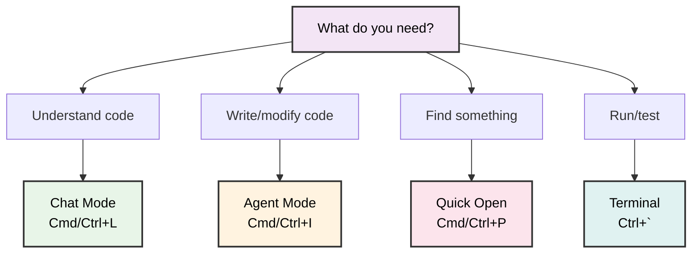
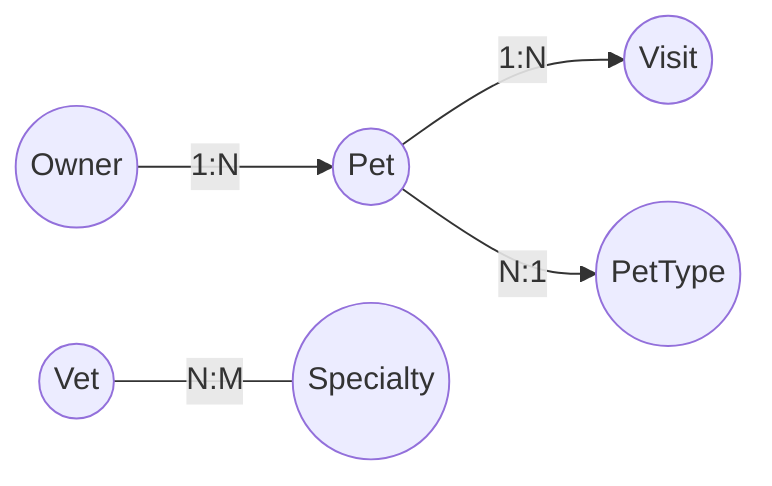
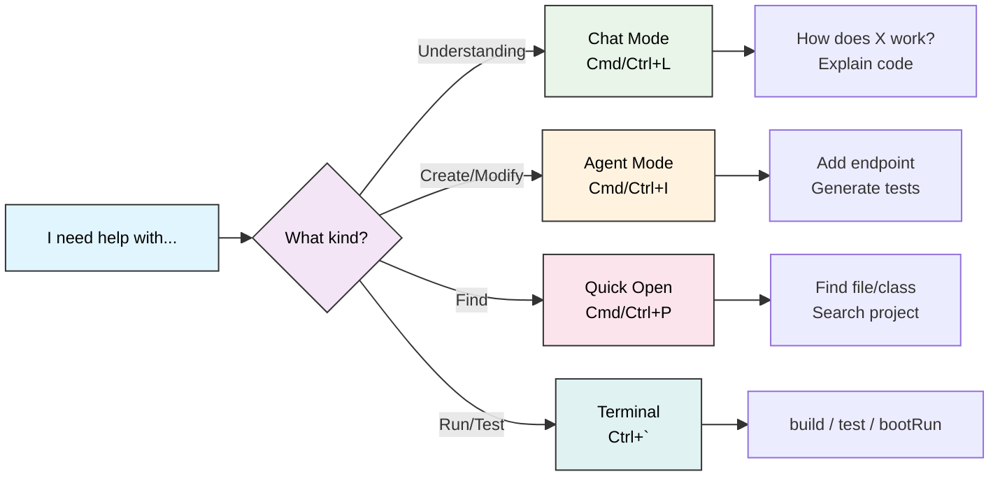

# Using Cursor for Java Development

<div class="pt-12">
  <span @click="$slidev.nav.next" class="px-2 py-1 rounded cursor-pointer" hover="bg-white bg-opacity-10">
    From IntelliJ to AI-Powered Development <carbon:arrow-right class="inline"/>
  </span>
</div>

<div class="abs-br m-6 flex gap-2">
  <button @click="$slidev.nav.openInEditor()" title="Open in Editor" class="text-xl slidev-icon-btn opacity-50 !border-none !hover:text-white">
    <carbon:edit />
  </button>
</div>

---

# Contact Info

Ken Kousen<br>
Kousen IT, Inc.

- ken.kousen@kousenit.com
- http://www.kousenit.com
- http://kousenit.org (blog)
- Social Media:
  - [@kenkousen](https://twitter.com/kenkousen) (Twitter)
  - [@kousenit.com](https://bsky.app/profile/kousenit.com) (Bluesky)
  - [https://www.linkedin.com/in/kenkousen/](https://www.linkedin.com/in/kenkousen/) (LinkedIn)
- *Tales from the jar side* (free newsletter)
  - https://kenkousen.substack.com
  - https://youtube.com/@talesfromthejarside

---

# Course Overview: 5 Sessions

<v-clicks>

1. **Using Cursor for Java Development** (Today - 3 hours)
   - Understanding code, navigation, generation, testing
2. **Using Cursor for Mobile Development** (3 hours)
   - Android/Kotlin with AI assistance
3. **Agentic Coding with Cursor** (3 hours)
   - Advanced AI workflows and automation
4. **Reviewing and Testing Code** (3 hours)
   - Quality assurance with AI
5. **Exploring Agents and MCP** (3 hours)
   - Model Context Protocol and advanced features

</v-clicks>

---

# Today's Session: What We'll Cover

<v-clicks>

- **Setup & Foundations** - Cursor workspace, extensions, AI modes
- **Project Creation** - Build a Spring Boot REST API from scratch
- **Code Generation** - REST controllers, services, repositories with AI
- **Testing** - Generate unit and integration tests
- **Code Understanding** - Analyze Spring PetClinic with AI
- **Terminal & Debugging** - Build, run, and debug workflows

</v-clicks>

---

# Two Projects Today

<v-clicks>

## Project 1: Hello Spring Boot
Build together from scratch - a complete REST API

## Project 2: Spring PetClinic
Understand complex existing code with AI

</v-clicks>

---

# Session Objectives

By the end of today, you will be able to:

<v-clicks>

- ✅ Navigate Cursor effectively for Java development
- ✅ Choose the right AI mode (Chat vs Agent) for each task
- ✅ Generate Spring Boot code with AI assistance
- ✅ Refactor and improve code quality
- ✅ Write tests efficiently with AI
- ✅ Understand unfamiliar codebases quickly

</v-clicks>

---
layout: section
---

# Part 1: Setup & Foundations

---

# Quick Setup Check

<v-clicks>

## Is Cursor Installed?
- Download from [cursor.sh](https://cursor.sh)
- Should be done from pre-session setup doc

## Essential Extensions
Open Extensions panel (Cmd/Ctrl+Shift+X) and verify:
- ✅ **Language Support for Java** (Red Hat)
- ✅ **Debugger for Java** (Microsoft)
- ✅ **Spring Boot Extension Pack** (VMware/Tanzu)
- ✅ **Gradle for Java** (Microsoft)
- ✅ **REST Client** (Huachao Mao) - like IntelliJ's HTTP client

**Install missing extensions now** - takes ~1 minute

</v-clicks>

---

# IntelliJ → Cursor: Key Concepts

<div class="grid grid-cols-2 gap-8">
<div>

## What's Familiar

<v-clicks>

- **Multi-window support** ✅
- **Integrated terminal** ✅
- **Git integration** ✅
- **Keyboard shortcuts** (similar)
- **Project structure** (folders/files)

</v-clicks>

</div>
<div>

## What's Different

<v-clicks>

- **Workspace** vs Project
- **AI-first** design
- **VS Code base** (different UI)
- **Command Palette** focus
- **Extension ecosystem**

</v-clicks>

</div>
</div>

---

# Opening Your First Workspace

**File → Open Folder** (Cmd/Ctrl+O)

<v-clicks>

- Navigate to project root (where `build.gradle` or `pom.xml` lives)
- Click **Open**
- Cursor auto-detects Java/Gradle/Maven
- Extensions activate for Java support

</v-clicks>

<v-click>

## 💡 Pro Tip: Multiple Windows

Like IntelliJ, you can have multiple Cursor windows open:
- One window per project
- Or one for code, one for reference
- **File → New Window** (Cmd/Ctrl+Shift+N)

</v-click>

---

# Understanding AI Modes

The most important concept in Cursor: **Chat vs Agent**

<div class="grid grid-cols-2 gap-8">
<div>

## Chat Mode (Cmd/Ctrl+L)

<v-clicks>

**Purpose:** Questions, explanations, understanding

**Use when you want to:**
- Understand how code works
- Get suggestions
- Learn about patterns
- Review code
- Explore options

**Read-only by default** - won't modify code

</v-clicks>

</div>
<div>

## Agent Mode (Cmd/Ctrl+I)

<v-clicks>

**Purpose:** Code generation, modifications

**Use when you want to:**
- Create new code
- Modify existing code
- Refactor methods
- Generate tests
- Add features

**Proposes concrete changes** - you review and accept

</v-clicks>

</div>
</div>

---

# Chat vs Agent: Live Demo

````md magic-move
```java
// Existing PersonController.java
@RestController
@RequestMapping("/api/persons")
public class PersonController {
    private final PersonService personService;
    
    @GetMapping
    public List<Person> findAll() {
        return personService.findAll();
    }
}
```

```java
// Prompt: "Explain how to add validation to POST requests"
// AI Response (Chat Mode):
// "To add validation for POST requests in Spring Boot:
// 1. Add @Valid annotation to @RequestBody parameter
// 2. Use Bean Validation annotations on entity (@NotNull, @Email, etc.)
// 3. Handle MethodArgumentNotValidException for error responses
// 
// Example:
// @PostMapping
// public Person create(@Valid @RequestBody Person person) { ... }
```

```java
// Prompt: "Add a POST endpoint with validation"
// Result (Agent Mode):
@RestController
@RequestMapping("/api/persons")
public class PersonController {
    private final PersonService personService;
    
    @GetMapping
    public List<Person> findAll() {
        return personService.findAll();
    }
    
    @PostMapping
    public ResponseEntity<Person> create(@Valid @RequestBody Person person) {
        Person saved = personService.save(person);
        return ResponseEntity.status(HttpStatus.CREATED).body(saved);
    }
}
```
````

**Key Difference:** Chat explains, Agent generates code

---

# Decision Tree: Which Mode?



---
layout: section
---

# Part 2: Building Hello Spring Boot
## Creating a REST API from Scratch

---

# Our First Project: Hello Spring Boot

## What We'll Build

A complete Spring Boot REST API with:
- ✅ REST Controllers (GET, POST, PUT, DELETE)
- ✅ Service Layer (business logic)
- ✅ JPA Entities & Repositories
- ✅ Bean Validation
- ✅ Unit & Integration Tests
- ✅ Modern Java patterns

---

# Why Start From Scratch?

<v-clicks>

- Everyone succeeds together
- See AI assistance from ground zero
- Controlled scope and clear deliverable
- Build confidence before analyzing complex code

</v-clicks>

---

# Step 1: Generate Project

## Using Spring Initializr in Cursor

**Command Palette** (Cmd/Ctrl+Shift+P):  
Type: `Spring Initializr: Create a Gradle Project`

<v-clicks>

**Configure:**
- **Spring Boot:** 3.5.6
- **Java:** 17 or 21
- **Group:** `com.example`
- **Artifact:** `hello-spring`

**Dependencies:** Spring Web, Spring Data JPA, H2 Database, Validation, DevTools

**Select folder** → Project opens in Cursor

</v-clicks>

---

# Step 2: First REST Controller

````md magic-move
```java
// Empty project structure
hello-spring/
├── src/main/java/com/example/hellospring/
│   └── HelloSpringApplication.java
└── build.gradle
```

```java
// Prompt: "Create a REST controller for a Greeting resource with a GET endpoint 
// that returns a greeting message with a name parameter"
// Result (Agent Mode):
package com.example.hellospring.controller;

import org.springframework.web.bind.annotation.*;

@RestController
@RequestMapping("/api/greetings")
public class GreetingController {
    
    @GetMapping
    public GreetingResponse greet(
            @RequestParam(defaultValue = "World") String name) {
        String message = "Hello, " + name + "!";
        return new GreetingResponse(message);
    }
    
    public record GreetingResponse(String message) {}
}
```

```java
// Run the application!
// Terminal (Ctrl+`):
// ./gradlew bootRun
//
// Test in browser:
// http://localhost:8080/api/greetings?name=Cursor
//
// Response:
// {"message": "Hello, Cursor!"}
```
````

**🎉 First success!** Everyone has a working endpoint

---

# Step 3: Add Service Layer

````md magic-move
```java
// Current: Controller doing everything
@RestController
@RequestMapping("/api/greetings")
public class GreetingController {
    @GetMapping
    public GreetingResponse greet(@RequestParam(defaultValue = "World") String name) {
        String message = "Hello, " + name + "!";  // Business logic in controller?
        return new GreetingResponse(message);
    }
}
```

```java
// Prompt: "Extract the greeting logic into a GreetingService with dependency injection"
// Result 1 - Generated Service:
package com.example.hellospring.service;

import org.springframework.stereotype.Service;

@Service
public class GreetingService {
    
    public String createGreeting(String name) {
        return String.format("Hello, %s! Welcome to Spring Boot with Cursor.", name);
    }
    
    public String createFormalGreeting(String name) {
        return String.format("Good day, %s. It's a pleasure to meet you.", name);
    }
}
```

```java
// Result 2 - Updated Controller:
@RestController
@RequestMapping("/api/greetings")
public class GreetingController {
    
    private final GreetingService greetingService;
    
    public GreetingController(GreetingService greetingService) {
        this.greetingService = greetingService;
    }
    
    @GetMapping
    public GreetingResponse greet(@RequestParam(defaultValue = "World") String name) {
        String message = greetingService.createGreeting(name);
        return new GreetingResponse(message);
    }
    
    @GetMapping("/formal")
    public GreetingResponse formalGreet(@RequestParam(defaultValue = "World") String name) {
        String message = greetingService.createFormalGreeting(name);
        return new GreetingResponse(message);
    }
}
```
````

**Key Learning:** Spring's constructor injection, separation of concerns

---

# Quick Student Exercise

## Your Turn: Add a Custom Greeting

Using **Agent Mode** (Cmd/Ctrl+I):

1. Add a new method to `GreetingService`:
   - Name it `createCustomGreeting`
   - Accept two parameters: `name` and `greetingWord`
   - Return formatted greeting using both

2. Add corresponding endpoint in `GreetingController`:
   - Path: `/custom`
   - Accept `name` and `greeting` as request params

---

# Test Your Custom Greeting

**Example result:**
```
GET /api/greetings/custom?name=Java&greeting=Bonjour
→ {"message": "Bonjour, Java! ..."}
```

**Hint:** Let AI do the work - describe what you want!

---
layout: section
---

# Part 3: Adding Persistence
## JPA, Entities, and Repositories

---

# Step 4: Create Person Entity

**AI Prompt (Agent Mode):**
```
Create a Person entity with id, firstName, lastName, and email.
Use JPA annotations and include validation for:
- firstName and lastName must not be blank
- email must be valid email format
```

---

# Generated Person Entity

```java
@Entity
@Table(name = "persons")
public class Person {
    
    @Id
    @GeneratedValue(strategy = GenerationType.IDENTITY)
    private Long id;
    
    @NotBlank(message = "First name is required")
    private String firstName;
    
    @NotBlank(message = "Last name is required")
    private String lastName;
    
    @Email(message = "Email must be valid")
    @NotBlank(message = "Email is required")
    private String email;
    
    // Constructor, getters, setters, equals, hashCode...
}
```

---

# Records vs Classes for JPA?

**Ask Chat:** "Should I convert this to a record? What are the trade-offs?"

<v-clicks>

**Traditional classes (POJOs) are better for JPA entities:**
- Records are immutable by default (final fields)
- JPA needs to modify fields directly
- Some JPA features require no-arg constructor

**Records work great for:**
- DTOs (Data Transfer Objects)
- Response/Request objects
- Value objects

**Takeaway:** Keep `Person` as a class, but we'll use records for API responses!

</v-clicks>

---

# Step 5: Add Repository

````md magic-move
```java
// Prompt: "Create a Spring Data JPA repository for Person with 
// custom query methods to find by lastName and email"
// Result (Agent Mode):
package com.example.hellospring.repository;

import com.example.hellospring.entity.Person;
import org.springframework.data.jpa.repository.JpaRepository;
import org.springframework.stereotype.Repository;
import java.util.List;
import java.util.Optional;

@Repository
public interface PersonRepository extends JpaRepository<Person, Long> {
    
    // Derived query methods - Spring generates implementation!
    List<Person> findByLastName(String lastName);
    
    Optional<Person> findByEmail(String email);
    
    List<Person> findByFirstNameContainingIgnoreCase(String firstName);
}
```

```java
// Follow-up with Chat: "How does Spring Data JPA generate these queries?"
// AI Response (Chat Mode):
// "Spring Data JPA uses method name parsing:
//
// findByLastName → SELECT * FROM persons WHERE last_name = ?
// findByEmail → SELECT * FROM persons WHERE email = ?
// findByFirstNameContainingIgnoreCase → WHERE LOWER(first_name) LIKE LOWER(?%)
//
// Keywords:
// - findBy, getBy, queryBy: SELECT queries
// - Containing: LIKE %value%
// - IgnoreCase: Case-insensitive comparison
//
// No SQL code needed - just follow naming convention!"
```
````

**Key Learning:** Spring Data JPA derived queries - convention over configuration

---

# Step 6: CRUD Controller

**AI Prompt (Agent Mode):**
```
Create a REST controller for Person with all CRUD operations.
Use PersonRepository for data access. Include proper HTTP status codes.
```

---

# PersonController: GET Operations

```java
@RestController
@RequestMapping("/api/persons")
public class PersonController {
    
    private final PersonRepository personRepository;
    
    public PersonController(PersonRepository personRepository) {
        this.personRepository = personRepository;
    }
    
    @GetMapping
    public List<Person> findAll() {
        return personRepository.findAll();
    }
    
    @GetMapping("/{id}")
    public ResponseEntity<Person> findById(@PathVariable Long id) {
        return personRepository.findById(id)
                .map(ResponseEntity::ok)
                .orElse(ResponseEntity.notFound().build());
    }
}
```

---

# PersonController: POST & PUT

```java
@PostMapping
public ResponseEntity<Person> create(@Valid @RequestBody Person person) {
    Person saved = personRepository.save(person);
    return ResponseEntity.status(HttpStatus.CREATED).body(saved);
}

@PutMapping("/{id}")
public ResponseEntity<Person> update(
        @PathVariable Long id, 
        @Valid @RequestBody Person person) {
    
    return personRepository.findById(id)
            .map(existing -> {
                existing.setFirstName(person.getFirstName());
                existing.setLastName(person.getLastName());
                existing.setEmail(person.getEmail());
                return ResponseEntity.ok(personRepository.save(existing));
            })
            .orElse(ResponseEntity.notFound().build());
}
```

---

# PersonController: DELETE

```java
@DeleteMapping("/{id}")
public ResponseEntity<Void> delete(@PathVariable Long id) {
    if (personRepository.existsById(id)) {
        personRepository.deleteById(id);
        return ResponseEntity.noContent().build();
    }
    return ResponseEntity.notFound().build();
}
```

**Complete CRUD operations with proper HTTP status codes!**

---

# Demo: Try the CRUD API

## Run the Application
```bash
./gradlew bootRun
```

## Manual verification

**Options:** curl, REST Client extension (.http files), or Postman

**Create a person (POST):**
```bash
curl -X POST http://localhost:8080/api/persons \
  -H "Content-Type: application/json" \
  -d '{"firstName":"John","lastName":"Doe","email":"john@example.com"}'
```

**Get all persons (GET):**
```bash
curl http://localhost:8080/api/persons
```

---

# More CRUD Demos

**Get one person (GET):**
```bash
curl http://localhost:8080/api/persons/1
```

**Update (PUT):**
```bash
curl -X PUT http://localhost:8080/api/persons/1 \
  -H "Content-Type: application/json" \
  -d '{"firstName":"Jane","lastName":"Doe","email":"jane@example.com"}'
```

**Delete (DELETE):**
```bash
curl -X DELETE http://localhost:8080/api/persons/1
```

---

# REST Client: The IntelliJ Way

**Create a `.http` file** (like IntelliJ's HTTP client)

Right-click `src/main/resources` → New File → `api-test.http`

```http
### Create a person
POST http://localhost:8080/api/persons
Content-Type: application/json

{
  "firstName": "John",
  "lastName": "Doe",
  "email": "john@example.com"
}

### Get all persons
GET http://localhost:8080/api/persons

### Get one person
GET http://localhost:8080/api/persons/1
```

**Click "Send Request"** link above each request to execute

---

# More .http Examples

```http
### Update person
PUT http://localhost:8080/api/persons/1
Content-Type: application/json

{
  "firstName": "Jane",
  "lastName": "Doe",
  "email": "jane@example.com"
}

### Delete person
DELETE http://localhost:8080/api/persons/1
```

**Tip:** Save this file in your project to share with your team!

---

# 🎉 Checkpoint: What We've Built

<v-clicks>

## So far, we have:

- ✅ **Complete Spring Boot REST API**
- ✅ **Greeting endpoints** with service layer
- ✅ **Person entity** with JPA & validation
- ✅ **Repository** with custom queries
- ✅ **CRUD controller** with proper HTTP methods
- ✅ **Working application** running on port 8080

## All with AI Assistance!

- Used **Agent** to generate code
- Used **Chat** to understand concepts
- Reviewed and learned from AI suggestions

**Next:** Code quality, refactoring, and testing

</v-clicks>

---
layout: section
---

# BREAK
## 10 Minutes

---
layout: section
---

# Part 4: Code Quality & Testing
## Refactoring and Test Generation

---

# Refactoring: Improving Code Quality

## Chat Mode for Code Review

<v-clicks>

**Prompt (Chat Mode):**
```
Review this PersonController and suggest improvements for:
- Code organization
- Error handling
- Best practices
- Modern Java patterns
```

**AI Suggestions:**
- Create DTOs instead of exposing entities directly
- Add global exception handling with `@ControllerAdvice`
- Extract update logic to service layer
- Use Java records for request/response objects
- Add proper logging

**Let's apply these improvements with Agent!**

</v-clicks>

---

# Creating DTOs with Records

**Current Problem:**
```java
@GetMapping
public List<Person> findAll() {
    return personRepository.findAll();  // Exposes entity structure
}
```

**AI Prompt (Agent Mode):**
```
Create PersonRequest and PersonResponse DTOs using Java records.
PersonRequest for POST/PUT, PersonResponse for GET responses
```

---

# Generated DTO: PersonRequest

```java
package com.example.hellospring.dto;

import jakarta.validation.constraints.*;

public record PersonRequest(
    @NotBlank(message = "First name is required")
    String firstName,
    
    @NotBlank(message = "Last name is required")
    String lastName,
    
    @Email(message = "Email must be valid")
    @NotBlank(message = "Email is required")
    String email
) {}
```

**Used for POST and PUT requests** (no id field)

---

# Generated DTO: PersonResponse

```java
public record PersonResponse(
    Long id,
    String firstName,
    String lastName,
    String email
) {
    public static PersonResponse from(Person person) {
        return new PersonResponse(
            person.getId(),
            person.getFirstName(),
            person.getLastName(),
            person.getEmail()
        );
    }
}
```

**Used for GET responses** (includes id field)

---

# Updated Controller Using DTOs

```java
@RestController
@RequestMapping("/api/persons")
public class PersonController {
    
    private final PersonRepository personRepository;
    
    @GetMapping
    public List<PersonResponse> findAll() {
        return personRepository.findAll().stream()
                .map(PersonResponse::from)
                .toList();
    }
    
    @PostMapping
    public ResponseEntity<PersonResponse> create(@Valid @RequestBody PersonRequest request) {
        Person person = new Person();
        person.setFirstName(request.firstName());
        person.setLastName(request.lastName());
        person.setEmail(request.email());
        
        Person saved = personRepository.save(person);
        return ResponseEntity.status(HttpStatus.CREATED)
                .body(PersonResponse.from(saved));
    }
}
```

**Better:** Separation between API contract and internal entities

---

# Global Exception Handling

**AI Prompt (Agent Mode):**
```
Create a global exception handler using @ControllerAdvice to handle
validation errors and resource not found exceptions with proper HTTP status codes
```

---

# Generated: GlobalExceptionHandler

```java
@RestControllerAdvice
public class GlobalExceptionHandler extends ResponseEntityExceptionHandler {
    
    @Override
    protected ResponseEntity<Object> handleMethodArgumentNotValid(
            MethodArgumentNotValidException ex, ...) {
        
        Map<String, String> errors = new HashMap<>();
        ex.getBindingResult().getFieldErrors().forEach(error -> 
            errors.put(error.getField(), error.getDefaultMessage())
        );
        
        ErrorResponse response = new ErrorResponse(
            LocalDateTime.now(),
            HttpStatus.BAD_REQUEST.value(),
            "Validation Failed",
            errors
        );
        
        return ResponseEntity.badRequest().body(response);
    }
    
    record ErrorResponse(LocalDateTime timestamp, int status, 
                        String message, Object errors) {}
}
```

---

# Structured Error Responses

**Before:** Generic Spring error response

**After:** Clear, structured JSON response

```json
{
  "timestamp": "2024-01-15T10:30:00",
  "status": 400,
  "message": "Validation Failed",
  "errors": {
    "firstName": "First name is required",
    "email": "Email must be valid"
  }
}
```

**Now validation errors return clear, structured responses!**

---

# Student Exercise: Code Review

## Your Turn!

<v-clicks>

1. **Open Chat Mode** (Cmd/Ctrl+L)

2. **Select your Person entity class**

3. **Ask for review:**
   ```
   Review this Person entity and suggest improvements
   ```

4. **Review AI suggestions**

5. **Apply ONE improvement** using Agent Mode
   - Example: Add a `toString()` method
   - Example: Add a convenience constructor
   - Example: Add an `@Column` annotation

**Share:** What improvement did you choose?

</v-clicks>

---
layout: section
---

# Test Generation
## Unit and Integration Tests with AI

---

# Generating Unit Tests

**AI Prompt (Agent Mode):**
```
Generate comprehensive unit tests for GreetingService using JUnit 5 
and AssertJ assertions. Test all public methods with edge cases.
```

---

# Generated: GreetingServiceTest (Part 1)

```java
@DisplayName("GreetingService Tests")
class GreetingServiceTest {
    private final GreetingService service = new GreetingService();
    
    @Test
    void shouldCreateGreetingWithName() {
        String result = service.createGreeting("Alice");
        assertThat(result).contains("Alice").startsWith("Hello");
    }
}
```

**Key Points:** Constructor injection, AssertJ assertions

---

# Generated: GreetingServiceTest (Part 2)

```java
@Test
void shouldCreateFormalGreeting() {
    String result = service.createFormalGreeting("Bob");
    assertThat(result).contains("Bob");
}

@Test
void shouldCreateCustomGreeting() {
    String result = service.createCustomGreeting("Charlie", "Bonjour");
    assertThat(result).contains("Bonjour").contains("Charlie");
}
```

**Run tests:** `./gradlew test`

---

# Generating Integration Tests

````md magic-move
```java
// Prompt: "Generate integration tests for PersonController using @SpringBootTest
// and MockMvc. Test all CRUD endpoints with valid and invalid data."
// Result (Agent Mode):

@SpringBootTest
@AutoConfigureMockMvc
@TestMethodOrder(MethodOrderer.OrderAnnotation.class)
class PersonControllerIntegrationTest {
    
    @Autowired private MockMvc mockMvc;
    @Autowired private ObjectMapper objectMapper;
    @Autowired private PersonRepository repository;
    
    @BeforeEach
    void setUp() {
        repository.deleteAll();
    }
}
```

````

---

# Integration Test: Valid Data

```java
@Test
@Order(1)
@DisplayName("Should create person with valid data")
void shouldCreatePerson() throws Exception {
    PersonRequest request = 
        new PersonRequest("John", "Doe", "john@example.com");
    
    mockMvc.perform(post("/api/persons")
            .contentType(MediaType.APPLICATION_JSON)
            .content(objectMapper.writeValueAsString(request)))
        .andExpect(status().isCreated())
        .andExpect(jsonPath("$.id").exists())
        .andExpect(jsonPath("$.firstName").value("John"));
}
```

**MockMvc** simulates HTTP requests without starting the server

---

# Integration Test: Invalid Data

```java
@Test
@Order(2)
@DisplayName("Should reject person with invalid email")
void shouldRejectInvalidEmail() throws Exception {
    PersonRequest request = 
        new PersonRequest("Jane", "Doe", "not-an-email");
    
    mockMvc.perform(post("/api/persons")
            .contentType(MediaType.APPLICATION_JSON)
            .content(objectMapper.writeValueAsString(request)))
        .andExpect(status().isBadRequest())
        .andExpect(jsonPath("$.errors.email").exists());
}
```

**Validation** works automatically with `@Valid` annotation

---

# Running Tests

```bash
# Run all tests
./gradlew test

# Run specific test class
./gradlew test --tests PersonControllerIntegrationTest

# Run with detailed output
./gradlew test --info

# Continuous testing (rerun on changes)
./gradlew test --continuous
```

**View Results:**
- Terminal: pass/fail summary
- HTML report: `build/reports/tests/test/index.html`

---

# AI-Assisted Test Debugging

<v-clicks>

**When tests fail**, paste the error into Chat Mode:

```
Chat: "Why is this test failing? [paste stack trace]"
```

**AI can help with:**
- Interpreting assertion failures
- Understanding stack traces
- Suggesting fixes for broken tests
- Explaining test framework behavior

**Pro tip:** Include test code + error message for best results

</v-clicks>

---

# Student Exercise: Generate Tests

## Your Turn!

<v-clicks>

1. **Select a service or controller method**

2. **Use Agent Mode** (Cmd/Ctrl+I):
   ```
   Generate unit tests for this method using JUnit 5 and AssertJ.
   Include happy path and edge cases.
   ```

3. **Review generated tests**

4. **Run tests:**
   ```bash
   ./gradlew test --tests YourTestClass
   ```

5. **If tests fail:** Ask Chat to debug

**Goal:** Everyone has at least one passing test

</v-clicks>

---

# 🎉 Checkpoint: Complete Application

<v-clicks>

## What We've Built So Far:

- ✅ **Spring Boot REST API** with CRUD operations
- ✅ **Service layer** for business logic
- ✅ **JPA entities & repositories**
- ✅ **Bean validation** with proper error handling
- ✅ **DTOs using records** (modern Java)
- ✅ **Global exception handling**
- ✅ **Unit tests** for services
- ✅ **Integration tests** for controllers

## All in ~90 Minutes!

**Next:** Understand complex existing code (Spring PetClinic)

</v-clicks>

---
layout: section
---

# BREAK
## 10 Minutes

---
layout: section
---

# Part 5: Understanding Complex Code
## Exploring Spring PetClinic with AI

---

# Spring PetClinic: Real-World Project

<v-clicks>

## Why PetClinic?

- **Real-world complexity** - Not a toy example
- **Well-architected** - Spring best practices
- **Multiple layers** - Controllers, services, repositories
- **Rich domain** - Owners, Pets, Vets, Visits
- **Active project** - VMware/Spring maintained

## Different Skills Needed

**Project 1 (Hello Spring):** Creation from scratch  
**Project 2 (PetClinic):** Understanding existing code

**Real-world scenario:** Joining a new team, existing codebase

</v-clicks>

---

# Setting Up PetClinic

## Clone the Repository

<v-clicks>

**Using Command Palette (Recommended):**

1. `Cmd+Shift+P` / `Ctrl+Shift+P`
2. Type: **"Git: Clone"**
3. Paste URL: `https://github.com/spring-projects/spring-petclinic`
4. Choose folder (e.g., `~/projects`)
5. **"Open in New Window"** when prompted

**Multi-window demo:** You now have both projects open!

</v-clicks>

---

# Alternative: Clone via Terminal

```bash
# Navigate to your projects folder
cd ~/projects

# Clone PetClinic
git clone https://github.com/spring-projects/spring-petclinic

# Open in new Cursor window
cd spring-petclinic
cursor .
```

**Both approaches work!** Command Palette is more discoverable.

---

# First Impressions: Project Structure

```
spring-petclinic/
├── src/main/java/...petclinic/
│   ├── owner/              # Owner domain
│   │   ├── Owner.java
│   │   ├── OwnerController.java
│   │   └── OwnerRepository.java
│   ├── pet/                # Pet domain
│   │   ├── Pet.java
│   │   ├── PetController.java
│   │   └── PetRepository.java
│   ├── vet/                # Vet domain
│   │   ├── Vet.java
│   │   ├── VetController.java
│   │   └── VetRepository.java
│   └── visit/              # Visit domain
├── src/main/resources/
│   ├── templates/          # Thymeleaf templates
│   └── application.properties
└── pom.xml
```

**Notice:** Domain-driven design, each entity has its own package

---

# AI-Powered Architecture Understanding

## Start with Big Picture Questions

**Chat Mode (Cmd/Ctrl+L):**

```
Explain the overall architecture of this Spring PetClinic application
```

**AI Response includes:**
- Layer architecture (Controller → Service → Repository)
- Domain model relationships
- Technology stack (Spring Boot, JPA, Thymeleaf, H2)
- Design patterns used

---

# Big Picture: Follow-ups

```
What design patterns are used in this application?
```

```
How is the database configured?
```

```
Explain the entity relationships using JPA annotations
```

---

# Understanding Entity Relationships

```md
Chat: "Explain the relationship between Owner, Pet, and Visit entities"
```

**Goal:** See how AI summarizes JPA relationships across entities

---

# Entity Relationships: Owner

```java
@Entity
public class Owner extends Person {
    @OneToMany(cascade = CascadeType.ALL, mappedBy = "owner")
    private Set<Pet> pets = new HashSet<>();
}
```

**Key Point:** One Owner has many Pets (`@OneToMany`)

---

# Entity Relationships: Pet

```java
@Entity
public class Pet extends NamedEntity {
    @ManyToOne @JoinColumn(name = "owner_id")
    private Owner owner;
    
    @OneToMany(cascade = CascadeType.ALL, mappedBy = "pet")
    private Set<Visit> visits = new LinkedHashSet<>();
}
```

**Key Points:** Many Pets belong to one Owner (`@ManyToOne`), one Pet has many Visits (`@OneToMany`)

---

# Entity Relationships: Visit

```java
@Entity
public class Visit extends BaseEntity {
    @ManyToOne @JoinColumn(name = "pet_id")
    private Pet pet;
}
```

**Key Point:** Many Visits belong to one Pet (`@ManyToOne`)

**AI extracts core relationships fast**

---

# Entity Relationships (Diagram)



---

# Tracing Request Flow with AI

```md
Chat: "Walk me through what happens when I GET /owners/1"
```

**Goal:** Understand the end-to-end path from controller → repository → view

---

# Request Flow: /owners/{id}

1. **HTTP Request** → `GET /owners/1`
2. **OwnerController.showOwner(...)** handles request
   ```java
   @GetMapping("/owners/{ownerId}")
   public ModelAndView showOwner(@PathVariable int ownerId)
   ```
3. **OwnerRepository.findById(...)** loads data
   ```java
   Owner owner = owners.findById(ownerId);
   ```
4. **JPA/Hibernate** executes query and maps entities
5. **Thymeleaf** renders the page with the `Owner` model

**AI advantage:** Explains full request flow in seconds

---

# Navigation Techniques in PetClinic

## Finding Your Way Around

**Quick Open (Cmd/Ctrl+P):**
- Type `Owner` → `Owner.java`, `OwnerController.java`, etc.
- Type `Owner:30` → Opens Owner.java at line 30

**Find Symbols (Cmd/Ctrl+Shift+O):**
- `findByLastName` → Repository method
- `addPet` → Controller method

**AI-Powered Search:**
```
Chat: "Show me all REST endpoints in this application"
Chat: "Find all methods that query the database"
Chat: "Which controllers handle pet operations?"
```

---

# Navigation: Go to Definition

**Jump quickly to code:**
- `Cmd+Click` on `Owner` → Entity class
- `F12` on method → Implementation

**Tip:** Use back/forward navigation (`Alt+Left/Right`) to hop around

---

# Student Exploration Exercise

## Guided Discovery with AI

<v-clicks>

**Use Chat Mode to answer these questions:**

1. **"How many entity classes are there? List them with their purpose"**

2. **"Which controller handles vet operations? Show me the endpoints"**

3. **"Explain how pet types are stored and retrieved from the database"**

4. **"What validation is applied to the Owner entity? List all constraints"**

5. **"How are visits associated with pets? Explain the relationship"**

**Bonus Challenge:**
```
"Find a potential bug or code smell in this codebase"
```

**Share your findings:** What did you discover?

</v-clicks>

---

# Advanced Analysis with AI

## Finding Patterns Across Codebase

<v-clicks>

**Architectural Analysis:**
```
Chat: "What Spring Boot features are used in this application?"
```

**Code Quality Review:**
```
Chat: "Review the OwnerController for best practices and potential improvements"
```

**Security Analysis:**
```
Chat: "Are there any security concerns in the data access layer?"
```

**Performance Questions:**
```
Chat: "Identify any N+1 query problems in the repository layer"
```

**AI can analyze patterns that are hard to find manually!**

</v-clicks>

---

# Running PetClinic

## Start the Application

**Terminal (Ctrl+`):**
```bash
./mvnw spring-boot:run
# or if Gradle:
./gradlew bootRun
```

**Open browser:**
```
http://localhost:8080
```

## Explore the UI

- Find Owners
- View Owner details
- Add new Pet
- Schedule Visit
- View Veterinarians

---

# Running PetClinic: Guided Exploration

**Ask AI while exploring:**
```
Chat: "How does the 'Add Pet' form submission work in the code?"
```

**Try these prompts:**
```
Chat: "Show me the controller + template involved in 'Find Owners'"
Chat: "Trace the flow for creating a new Visit"
```

---
layout: section
---

# Part 6: Terminal, Debugging & Workflows
## Professional Development Setup

---

# Terminal Integration

<v-clicks>

## Opening Terminal(s)

**Shortcut:** ``Ctrl+` `` (backtick)  
**Or:** View → Terminal

## Multiple Terminal Sessions

- Click **+** icon for new terminal
- Split terminal: Click split icon
- Switch with dropdown menu

**Common Setup for Spring Boot:**
```bash
Terminal 1: ./gradlew bootRun      # Running app
Terminal 2: ./gradlew test --continuous  # Test watcher  
Terminal 3: git status              # Version control
```

</v-clicks>

---

# Gradle Tasks: Build and Test

```bash
./gradlew build
./gradlew test
./gradlew test --tests PersonControllerTest
```

---

# Gradle Tasks: Run and Utilities

```bash
./gradlew bootRun
./gradlew clean build
./gradlew dependencies
```

**AI can help:**
- "Run the Spring Boot application"
- "Execute all tests and show results"
- "Build the project and tell me if there are errors"

---

# Debugging in Cursor

## Setting Up Debug Session

<v-clicks>

**Method 1: CodeLens (appears above main method)**
```java
public class HelloSpringApplication {
    // "Run | Debug" appears here ↓
    public static void main(String[] args) {
        SpringApplication.run(HelloSpringApplication.class, args);
    }
}
```
Click **Debug**

**Method 2: Debug Panel**
- Click Run & Debug icon (left sidebar)
- Click "create a launch.json file"
- Select "Java"
- Press F5 to start

</v-clicks>

---

# Debugging Workflow

````md magic-move
```java
// 1. Set breakpoint: Click line number gutter
@GetMapping("/{id}")
public ResponseEntity<PersonResponse> findById(@PathVariable Long id) {
    // ← Click here to set breakpoint (red dot appears)
    return personRepository.findById(id)
            .map(PersonResponse::from)
            .map(ResponseEntity::ok)
            .orElse(ResponseEntity.notFound().build());
}
```

```java
// 2. Start debugging (F5)
// 3. Make request: http://localhost:8080/api/persons/1
// 4. Execution pauses at breakpoint

// Debug controls:
// F10 - Step Over (next line)
// F11 - Step Into (enter method)
// Shift+F11 - Step Out (exit method)
// F5 - Continue (next breakpoint)
```

```java
// 5. Inspect variables (Debug panel shows):
// - id = 1
// - personRepository = PersonRepository@1a2b3c
// - [Hover over variables for values]

// 6. Evaluate expressions (Debug Console):
// > id * 2
// 2
// > personRepository.count()
// 5
```
````

**Variables panel, Watch expressions, Call stack - all available!**

---

# AI-Assisted Debugging

<v-clicks>

## When Things Go Wrong

**Test Failure:**
```
Chat: "Why is this test failing?"
[Paste error message]
```

**Runtime Exception:**
```
Chat: "Explain this stack trace and suggest a fix"
[Paste stack trace]
```

**Unexpected Behavior:**
```
Chat: "This endpoint returns 404 but should return 200. 
Here's the controller code: [paste code]"
```

**AI analyzes errors and suggests solutions!**

</v-clicks>

---

# Multi-Window Professional Setup

<div class="grid grid-cols-2 gap-8">
<div>

## Window 1: Your Project
```
hello-spring/
├── Active development
├── Terminal: ./gradlew bootRun
├── Debug session
└── Agent: Code generation
```

**Used for:**
- Writing code
- Running tests
- Debugging issues
- Active development

</div>
<div>

## Window 2: Reference Project
```
spring-petclinic/
├── Code examples
├── Terminal: read-only
├── Chat: Understanding
└── Reference only
```

**Used for:**
- Learning patterns
- Finding examples
- Understanding architecture
- Quick reference

</div>
</div>

---

# Multi-Window Benefits

<v-clicks>

**Each window has:**
- ✅ Independent AI context
- ✅ Separate terminal sessions
- ✅ Own Git state
- ✅ Different debugging session

**Pro tip:** Keep examples open in second window for quick reference while coding in the first!

</v-clicks>

---

# Productivity Shortcuts Review

| Task | Shortcut | What It Does |
|------|----------|--------------|
| **Quick Open** | `Cmd/Ctrl+P` | Find any file, class, symbol |
| **Command Palette** | `Cmd/Ctrl+Shift+P` | Access all commands |
| **Find in Files** | `Cmd/Ctrl+Shift+F` | Search entire project |
| **Chat Mode** | `Cmd/Ctrl+L` | Ask AI questions |
| **Agent Mode** | `Cmd/Ctrl+I` | Generate/modify code |
| **Terminal** | ``Ctrl+` `` | Open/close terminal |

---

# Productivity Shortcuts Review (cont.)

| Task | Shortcut | What It Does |
|------|----------|--------------|
| **Go to Definition** | `F12` | Jump to code definition |
| **Find Usages** | `Shift+F12` | Where is this used? |
| **Debug** | `F5` | Start debugging |
| **Step Over** | `F10` | Debug: next line |

**Print this slide for reference!**

---
layout: section
---

# Wrap-Up & Key Takeaways

---

# What We Accomplished Today: Hello Spring Boot

- Complete REST API with CRUD operations
- Service layer with dependency injection
- JPA entities and repositories
- Bean validation and error handling
- DTOs using modern Java records
- Unit and integration tests

---

# What We Accomplished Today: Spring PetClinic

- Understood complex architecture quickly
- Traced request flows
- Identified entity relationships
- Found patterns and potential issues
- Navigated efficiently


---

# Key Takeaways: The Decision Tree



---

# Best Practices Learned (1/2)

1. **Start with Chat to understand, then use Agent to implement**
   - Understanding first → better results

2. **Review AI suggestions before accepting**
   - AI is a pair programmer, not autopilot

3. **Use specific, detailed prompts**
   - ✅ "Add Bean Validation: firstName/lastName not blank; email format"

---

# Best Practices Learned (2/2)

4. **Leverage multi-window for reference**
   - Keep examples open in second window
   - Independent contexts prevent confusion

5. **Let AI handle boilerplate**
   - Tests, DTOs, CRUD scaffolding
   - Focus on business logic

---

# Available Resources

## Quick Reference

- ✅ `cursor-quickstart-for-intellij-users.md` — IntelliJ → Cursor guide
- ✅ `session1-outline.md` — Full outline
- ✅ `slides.md` — Slidev deck

---

# Available Resources (cont.)

## Labs & Practice

- ✅ `labs.md` — Code-along + homework
- ✅ Hello Spring Boot — Starter project
- ✅ Spring PetClinic — `git clone https://github.com/spring-projects/spring-petclinic`
- Practice: redo code-alongs, PetClinic challenges, advanced refactoring

---

# Q&A

## Questions?

**Common Topics:**
- Setup issues or extension problems
- AI not working as expected
- Java Language Server troubleshooting
- Best practices for specific scenarios
- Preview of next sessions

<v-click>

<div class="mt-12 text-center">

**Remember:** When in doubt, ask the AI!  
`Cmd/Ctrl+L` → "How do I...?"

</div>

</v-click>

---

# Thank You!

<div class="text-center">

## Great Work Today! 🎉

<div class="pt-12">
  <span class="text-6xl">☕ + 🤖 = 🚀</span>
</div>

**Kenneth Kousen**  
*Java Champion, Author, Speaker*

[kousenit.com](https://kousenit.com) | [@kenkousen](https://twitter.com/kenkousen)

<div class="mt-8">
  <span class="text-2xl">See you next session for Mobile Development!</span>
</div>

</div>

---

# Appendix: Advanced Cursor Features

## Plan Mode (high-level planning)

- Draft a step-by-step change plan before edits
- Best for multi-file refactors/migrations
- Ask Chat: "Create a plan to ..." then review/approve
- Execute approved steps; iterate as needed
- Keep plans small (PR-sized) for reviewability

---

# Advanced Cursor Features (cont.)

## Slash Commands (custom prompts)

- Type "/" in Chat to run reusable command templates
- Add/edit: Settings → Commands ("Cursor: Open Commands")
- Great for "Generate unit tests" or "Refactor selection"
- Use placeholders (selection, file) for context

---

# Advanced Cursor Features (cont.)

## .cursorrules (project guidance)

- Put `.cursorrules` at repo root to guide AI
- Capture coding standards and architectural rules
- Keep concise; link to longer docs
- Commit so the team benefits

---

# Appendix: Troubleshooting (1/2)

**Java Language Server not loading**
```
Cmd/Ctrl+Shift+P → "Java: Clean Java Language Server Workspace"
```

**Gradle tasks not recognized**
```bash
./gradlew tasks --all
# Or: Cmd/Ctrl+Shift+P → "Gradle: Refresh Gradle Project"
```

**AI seems confused or wrong**
- Start new Chat (Cmd/Ctrl+L → New Chat)
- Be specific; add code/context

---

# Appendix: Troubleshooting (2/2)

**Imports not resolving**
- Ensure "Language Support for Java" extension installed
- Check build.gradle/pom.xml dependencies
- Cmd/Ctrl+Shift+P → "Java: Clean Workspace"

---

# Appendix: Additional Resources

## Cursor & Spring

- [docs.cursor.com](https://docs.cursor.com) — Official docs
- [forum.cursor.sh](https://forum.cursor.sh) — Community forum
- [spring.io/guides](https://spring.io/guides) — Spring guides
- [Spring PetClinic](https://github.com/spring-projects/spring-petclinic) — Reference app

---

# Additional Resources (cont.)

## Java & VS Code

- [code.visualstudio.com/docs/java](https://code.visualstudio.com/docs/java) — Java in VS Code
- [marketplace.visualstudio.com](https://marketplace.visualstudio.com) — Extensions

## Ken's Resources

- [kousenit.com](https://kousenit.com) — Courses and training
- [kousenit.org](https://kousenit.org) — Blog
- [Tales from the jar side](https://kenkousen.substack.com) — Newsletter
- [Tales from the jar side YouTube channel](https://youtube.com/@talesfromthejarside)

